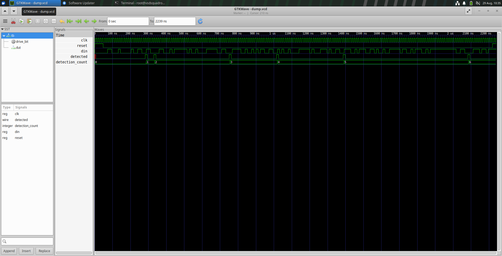
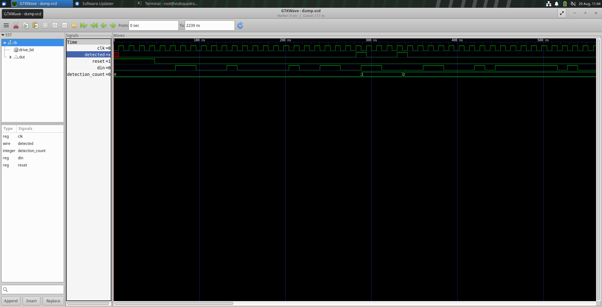
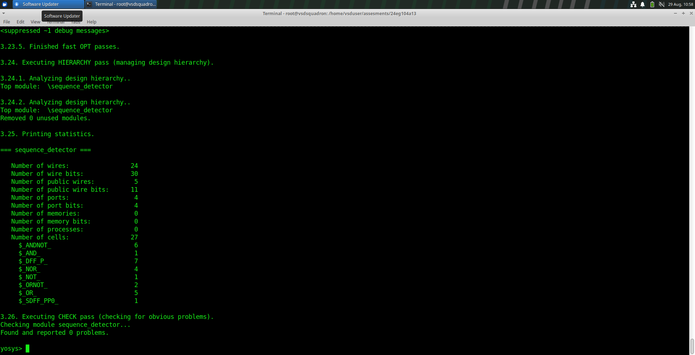
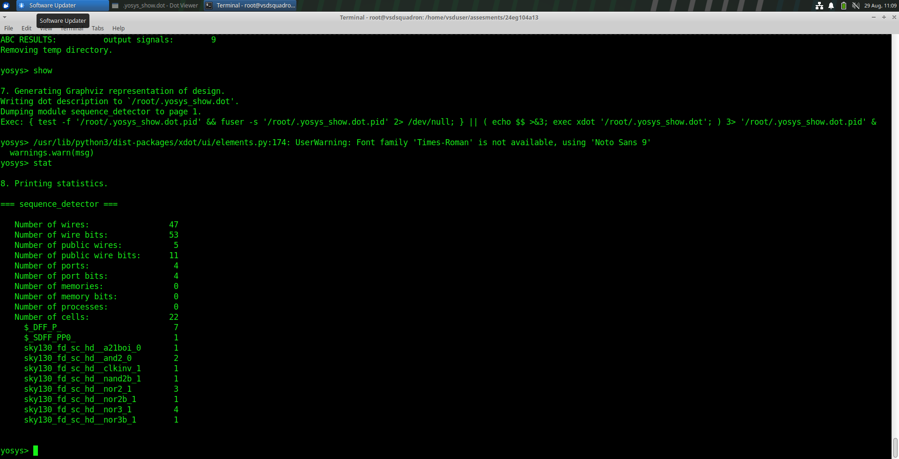
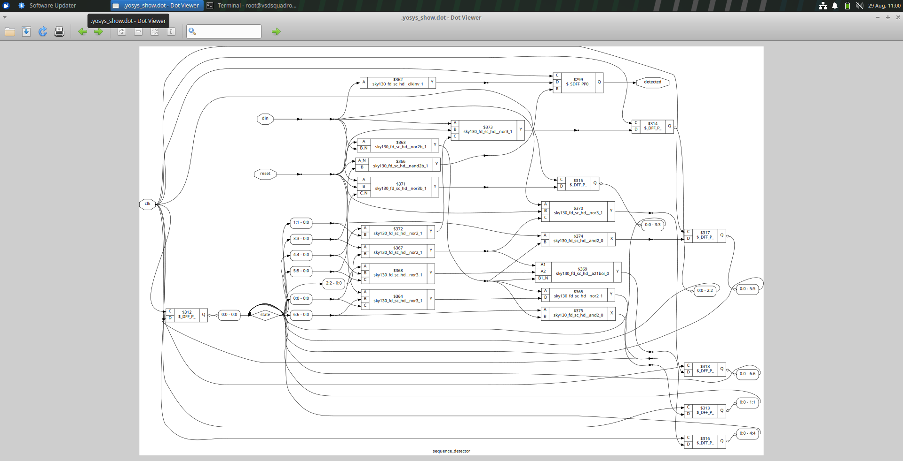
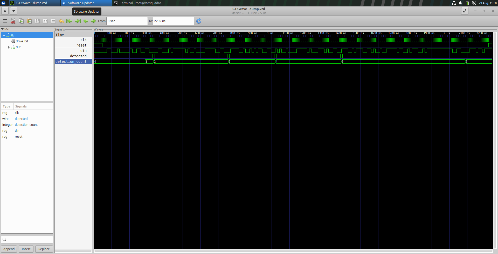
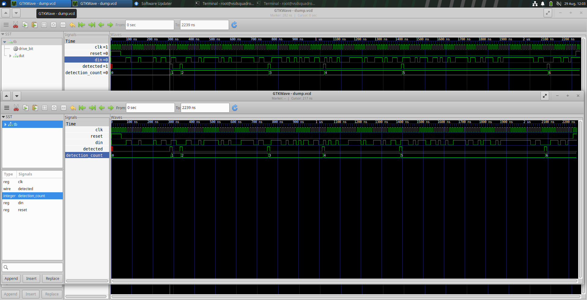

# Sequence Detector – RTL to GLS Verification


## Overview

This assignment demonstrates the complete digital design flow of a **7-bit sequence detector**, starting from RTL design and functional simulation and continuing through synthesis, netlist generation, and Gate-Level Simulation (GLS).

The target sequence for detection is:

```text
1001100
````

The design is implemented as a **Finite State Machine (FSM)**. The FSM keeps track of how many bits of the target sequence have been matched and asserts the `detected` output when the complete sequence is received.

The overall flow followed in this assignment is:

```text
RTL Design
    ↓
RTL Simulation
    ↓
Waveform Verification
    ↓
Yosys Synthesis
    ↓
Synthesis Statistics
    ↓
Synthesized Netlist
    ↓
Gate-Level Simulation (GLS)
    ↓
RTL vs GLS Comparison
```

---

# 1. Target Sequence

The sequence detector is designed to detect the following 7-bit sequence:

```text
1001100
```

The FSM contains seven matching states corresponding to the progress of detecting the sequence.

| State | Meaning          |
| ----: | ---------------- |
|     0 | No bits matched  |
|     1 | `1` matched      |
|     2 | `10` matched     |
|     3 | `100` matched    |
|     4 | `1001` matched   |
|     5 | `10011` matched  |
|     6 | `100110` matched |

When the FSM is in **State 6** and receives a `0`, the complete sequence `1001100` has been detected.

The FSM then returns to State 3, allowing overlapping sequences to be detected.

---

# 2. RTL Design

The sequence detector is implemented using a standard two-process FSM structure:

1. **Combinational logic**

   * Determines `next_state`
   * Determines `next_detected`

2. **Sequential logic**

   * Stores the current state
   * Registers the `detected` output
   * Operates on the rising edge of `clk`

## RTL Code

```verilog
`timescale 1ns/1ps

module sequence_detector (
    input  wire clk,
    input  wire reset,
    input  wire din,
    output reg detected
);

    localparam integer STATE_W = 3;
    localparam integer NUM_STATES = 7;

    // Target sequence: 1001100

    reg [STATE_W-1:0] state;
    reg [STATE_W-1:0] next_state;
    reg next_detected;

    // Next-state and output combinational logic
    always @(*) begin
        next_state = 'd0;
        next_detected = 1'b0;

        case (state)

            // State 0: No bits matched
            0: begin
                if (din == 1'b0) begin
                    next_state = 0;
                    next_detected = 1'b0;
                end else begin
                    next_state = 1;
                    next_detected = 1'b0;
                end
            end

            // State 1: "1" matched
            1: begin
                if (din == 1'b0) begin
                    next_state = 2;
                    next_detected = 1'b0;
                end else begin
                    next_state = 1;
                    next_detected = 1'b0;
                end
            end

            // State 2: "10" matched
            2: begin
                if (din == 1'b0) begin
                    next_state = 3;
                    next_detected = 1'b0;
                end else begin
                    next_state = 1;
                    next_detected = 1'b0;
                end
            end

            // State 3: "100" matched
            3: begin
                if (din == 1'b0) begin
                    next_state = 0;
                    next_detected = 1'b0;
                end else begin
                    next_state = 4;
                    next_detected = 1'b0;
                end
            end

            // State 4: "1001" matched
            4: begin
                if (din == 1'b0) begin
                    next_state = 2;
                    next_detected = 1'b0;
                end else begin
                    next_state = 5;
                    next_detected = 1'b0;
                end
            end

            // State 5: "10011" matched
            5: begin
                if (din == 1'b0) begin
                    next_state = 6;
                    next_detected = 1'b0;
                end else begin
                    next_state = 1;
                    next_detected = 1'b0;
                end
            end

            // State 6: "100110" matched
            6: begin
                if (din == 1'b0) begin
                    // Complete sequence "1001100" detected
                    next_state = 3;
                    next_detected = 1'b1;
                end else begin
                    next_state = 1;
                    next_detected = 1'b0;
                end
            end

            default: begin
                next_state = 'd0;
                next_detected = 1'b0;
            end

        endcase
    end

    // Sequential state and output registers
    always @(posedge clk) begin
        if (reset) begin
            state <= 'd0;
            detected <= 1'b0;
        end else begin
            state <= next_state;
            detected <= next_detected;
        end
    end

endmodule
```

---

# 3. FSM Operation

The FSM progresses through the target sequence one bit at a time.

For the target sequence:

```text
1 0 0 1 1 0 0
```

the state progression is:

```text
State 0
   |
   | 1
   ↓
State 1
   |
   | 0
   ↓
State 2
   |
   | 0
   ↓
State 3
   |
   | 1
   ↓
State 4
   |
   | 1
   ↓
State 5
   |
   | 0
   ↓
State 6
   |
   | 0
   ↓
Detection!
```

When the final `0` arrives while the FSM is in State 6:

```verilog
next_detected = 1'b1;
```

Therefore, the `detected` output becomes high after the next rising clock edge.

The FSM returns to State 3 after detection, which allows overlapping occurrences to be detected.

---

# 4. State Storage

The current FSM state is stored in:

```verilog
reg [STATE_W-1:0] state;
```

Since there are seven states:

```text
NUM_STATES = 7
```

three bits are sufficient to represent the state:

```text
STATE_W = 3
```

because:

```text
2^3 = 8
```

which is enough to represent states 0 through 6.

---

# 5. Output Generation

The `detected` output is registered in the sequential block:

```verilog
always @(posedge clk)
```

The combinational logic generates:

```verilog
next_detected
```

based on both:

* the current FSM state
* the current input `din`

The detection condition is specifically:

```text
Current state = 6
din = 0
```

which corresponds to receiving the final bit of:

```text
1001100
```

---

# 6. Testbench

The testbench generates the clock, reset, input sequence, and detection count.

The clock is generated using:

```verilog
always #6 clk = ~clk;
```

Therefore:

```text
Clock half-period = 6 ns
Clock period      = 12 ns
Clock frequency   ≈ 83.33 MHz
```

The testbench drives each input bit on a clock boundary using the `drive_bit` task.

```verilog
task drive_bit(input reg b);
    begin
        @(negedge clk);
        din = b;

        @(posedge clk);
        #1;

        $display(
            "TIME=%0t NS DIN=%b DETECTED=%b",
            $time,
            din,
            detected
        );
    end
endtask
```

The testbench also counts detection events:

```verilog
integer detection_count = 0;

always @(negedge clk) begin
    if (!reset && detected)
        detection_count = detection_count + 1;
end
```

The final detection count observed during the simulation was:

```text
6
```

---

# 7. RTL Simulation

The RTL simulation was performed using the supplied testbench and the generated waveform was inspected using GTKWave.

### RTL Simulation Waveform



The waveform shows:

* `clk`
* `reset`
* `din`
* `detected`
* `detection_count`

The detection counter increases whenever the sequence detector produces a detection pulse.

---

# 8. Simulation Evidence

An additional simulation waveform screenshot is included below.



The waveform confirms the occurrence of detection pulses during simulation.

---

# 9. Synthesis Using Yosys

The RTL was synthesized using **Yosys**.

The synthesis process converts the behavioral RTL description into a gate-level representation consisting of flip-flops and combinational logic cells.

The synthesized design contains:

* Sequential cells for storing FSM state and registered output
* Combinational logic cells for implementing the next-state and detection logic

---

# 10. Synthesis Statistics

The Yosys synthesis statistics showed:

```text
Number of wires:       47
Number of wire bits:   53
Number of public wires: 5
Number of public wire bits: 11
Number of ports:       4
Number of port bits:   4
Number of memories:    0
Number of processes:   0
Number of cells:       22
```

The sequential cells include:

```text
$DFF_P    7
$SDFF_PP  1
```

Thus, the synthesized design contains **8 sequential flip-flop cells**.

The remaining synthesized cells are combinational logic cells.

### Synthesis Statistics Screenshot



Additional statistics evidence:



---

# 11. Synthesized Netlist

After synthesis, the RTL was converted into a gate-level netlist.

The synthesized netlist represents the FSM using actual flip-flop and combinational cells instead of the original behavioral RTL constructs.

### Synthesized Netlist



---

# 12. Synthesized Netlist with Command

The synthesized netlist and associated Yosys command/output are shown below.


---

# 13. Graphical Schematic

The synthesized design was also converted into a graphical representation using Yosys/Graphviz.

The schematic shows:

* FSM state storage flip-flops
* Combinational logic
* Input `din`
* Reset
* Clock
* Detection output
* Feedback paths implementing the FSM transitions

### Synthesized Graphical Schematic


---

# 14. Gate-Level Simulation (GLS)

After synthesis, the synthesized netlist was used for Gate-Level Simulation.

GLS verifies that the synthesized gate-level implementation behaves consistently with the original RTL design.

The GLS waveform was inspected using GTKWave.

### GLS Waveform



The GLS waveform shows the same logical sequence-detection behavior as the RTL simulation.

---

# 15. GLS Simulation Evidence

An additional GLS waveform screenshot is provided below.


The first detection event can be observed in the waveform, followed by subsequent detection events during the complete simulation.

---

# 16. RTL vs GLS Comparison

The RTL and GLS simulations were compared to verify functional equivalence.

The comparison shows that:

* The same target sequence is detected.
* The detection events occur in the same logical order.
* The synthesized implementation preserves the intended FSM functionality.
* GLS introduces timing differences because the synthesized gates and flip-flops have propagation delays.

### RTL vs GLS Comparison



Therefore, synthesis does not change the intended logical behavior of the sequence detector.

---

# 17. Timing Difference

One timing difference observed between RTL and GLS is the shift in signal transitions caused by propagation delays.

In RTL simulation, the behavioral model does not contain physical gate delays.

In GLS, the signal passes through synthesized flip-flops and combinational gates, resulting in small timing shifts in transitions.

Therefore:

```text
RTL:
Clock → RTL logic → Output

GLS:
Clock → Flip-Flops/Gates → Output
                   ↑
            Propagation delay
```

The timing difference does not change the logical detection sequence.

---

# 18. Final Results

The important results obtained from the assignment are:

| Parameter                    | Result                |
| ---------------------------- | --------------------- |
| Target sequence              | `1001100`             |
| Number of FSM states         | 7                     |
| State storage bits           | 3                     |
| Clock half-period            | 6 ns                  |
| Clock period                 | 12 ns                 |
| Clock frequency              | ~83.33 MHz            |
| RTL detection events         | 6                     |
| GLS detection behavior       | Same logical behavior |
| Synthesized sequential cells | 8                     |
| Total synthesized cells      | 22                    |

---

# 19. Conclusion

The sequence detector was successfully designed and verified using an FSM-based RTL implementation. The RTL simulation confirmed that the design correctly detects the target sequence `1001100`, producing the expected detection events during the testbench execution.

The RTL was successfully synthesized using Yosys, resulting in a gate-level implementation containing sequential and combinational cells. The synthesized netlist was then verified through Gate-Level Simulation, and the GLS results preserved the same logical detection behavior observed in RTL simulation.

Small timing differences were observed between RTL and GLS due to propagation delays introduced by the synthesized gates and flip-flops. However, these timing differences did not affect the functional behavior of the sequence detector.

Overall, the assignment demonstrates the complete flow:

```text
RTL
 ↓
Simulation
 ↓
Synthesis
 ↓
Netlist
 ↓
GLS
 ↓
RTL vs GLS Verification
```

and confirms that the synthesized implementation preserves the intended functionality of the original RTL design.

````
