# Day 10 – Physical Design Capstone: Power Planning, CTS, Timing & Routing (Module 5)

## Objective

This is the final module of the RTL-to-GDSII workshop, and its core focus is **routing** — global routing, detailed routing, the underlying maze-routing algorithm, and the two actual open-source tools (FastRoute and TritonRoute) that implement these stages inside OpenLane. Beyond routing itself, this session also revisits and deepens a few earlier physical-design concepts — power planning, clock tree synthesis and clock-net protection, and setup/hold timing — before wrapping up with the final, completed physical implementation results for PicoRV32a.

Since this module ties together concepts from every earlier physical-design session (Days 7–9), the material here goes a level deeper than previous days rather than introducing something entirely new — this README reflects that by covering both the recap material and the new routing-specific content in full detail.

---

## Contents

1. [Where Routing Sits in the Flow](#1-where-routing-sits-in-the-flow)
2. [Power Planning — Recap](#2-power-planning--recap)
3. [Clock Tree Synthesis & Clock Net Protection](#3-clock-tree-synthesis--clock-net-protection)
4. [Setup and Hold Timing Classes — Recap](#4-setup-and-hold-timing-classes--recap)
5. [RC Delay Modeling](#5-rc-delay-modeling)
6. [Routing: Global vs. Detailed](#6-routing-global-vs-detailed)
7. [The Maze Routing Algorithm (Lee's Algorithm)](#7-the-maze-routing-algorithm-lees-algorithm)
8. [FastRoute — Global Routing in OpenLane](#8-fastroute--global-routing-in-openlane)
9. [TritonRoute — Detailed Routing in OpenLane](#9-tritonroute--detailed-routing-in-openlane)
10. [Final PicoRV32a Physical Design Results](#10-final-picorv32a-physical-design-results)
11. [Conclusion](#11-conclusion)

---

## 1. Where Routing Sits in the Flow

```
RTL → Synthesis → Floorplan → Power Planning → Placement
    → Clock Tree Synthesis → Global Routing → Detailed Routing
    → RC Extraction → Post-Route STA → Physical Verification (DRC/LVS) → GDSII
```

By this stage of the workshop, PicoRV32a has already been through synthesis, floorplanning, and placement (Days 7 and 9). Routing is the step that turns all those *placed but unconnected* standard cells into an actual, physically wired circuit — every net in the design needs a real metal path connecting its driver to every one of its loads, obeying the technology's design rules the entire way.

---

## 2. Power Planning — Recap

Power planning was introduced in Day 7, but is worth revisiting here since routing and power distribution share the same physical metal resources and directly compete for space.

A power distribution network exists because real metal wires have resistance, and current flowing through that resistance causes a voltage drop (`V = I × R`, commonly called **IR drop**). Left unmanaged, cells farther from the power source see a weaker, less reliable supply. The standard solution is a layered structure:

```
Power Source → Power Ring → Power Straps/Mesh → Standard-Cell Rails → Individual Cells
```

Higher metal layers (e.g. met4/met5) distribute power efficiently over long distances with lower resistance; lower layers (met1) make the fine-grained connection into each standard-cell row. The mesh structure specifically provides *multiple* current paths to every cell, which lowers the network's effective resistance compared to a single path.

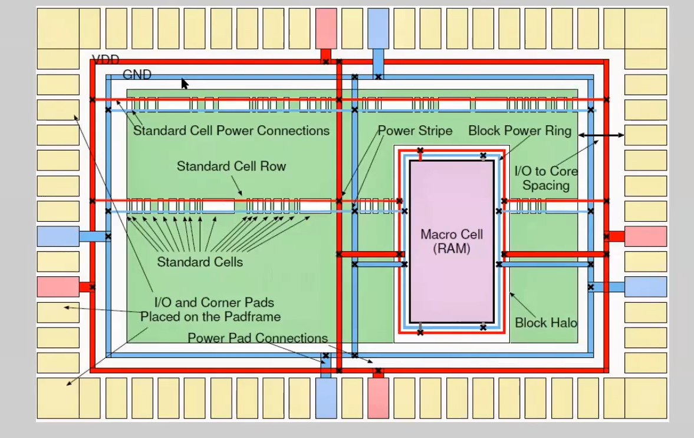

---

## 3. Clock Tree Synthesis & Clock Net Protection

CTS builds a buffered distribution network so the clock signal reaches every flip-flop with minimal skew — introduced conceptually in Day 7, and now shown with the actual generated files for PicoRV32a.

**CTS script/configuration used:**

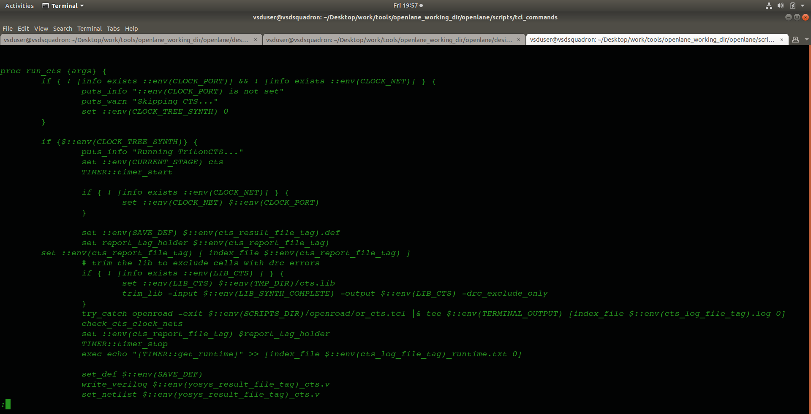

**Clock buffers inserted into the tree:**

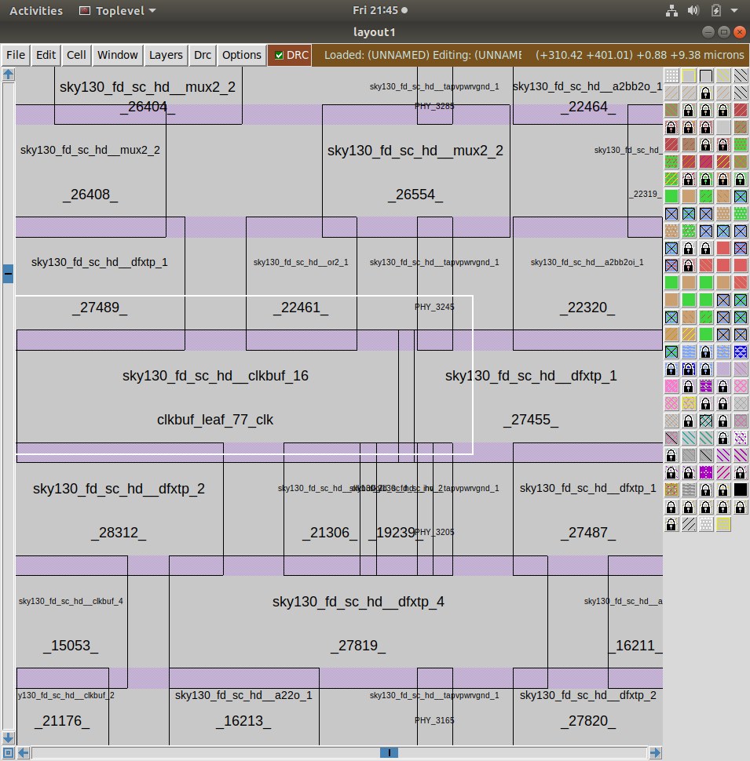

### Why the Clock Net Needs Special Protection

The clock is arguably the single most timing-sensitive net in the entire chip — every flip-flop in the design depends on it arriving with minimal skew and a clean edge. Ordinary signal nets can tolerate a certain amount of crosstalk-induced noise or delay variation without breaking functionality, but noise coupled onto the clock net can cause **every** sequential element downstream to sample data incorrectly at once.

To guard against this, clock nets are typically **shielded**: a grounded (or VDD-tied) wire is routed directly alongside the clock net on the same or adjacent track, absorbing capacitive coupling from neighboring signal wires before it can reach the clock line itself. Clock nets are also often routed with wider wires and on layers with more predictable, controlled resistance/capacitance behavior.

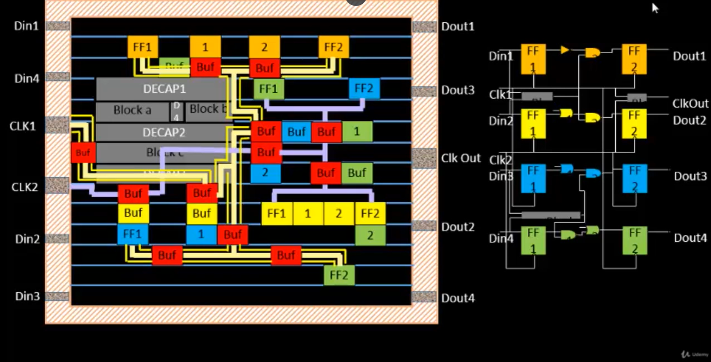

---

## 4. Setup and Hold Timing Classes — Recap

Setup and hold checks were covered practically in Day 9's OpenSTA work; this module revisits the conceptual definitions in more depth.

**Setup timing** governs how *late* data is allowed to arrive at a capturing flip-flop relative to the next active clock edge — checked against the circuit's **slowest** realistic corner, since that's when data takes the longest to propagate.

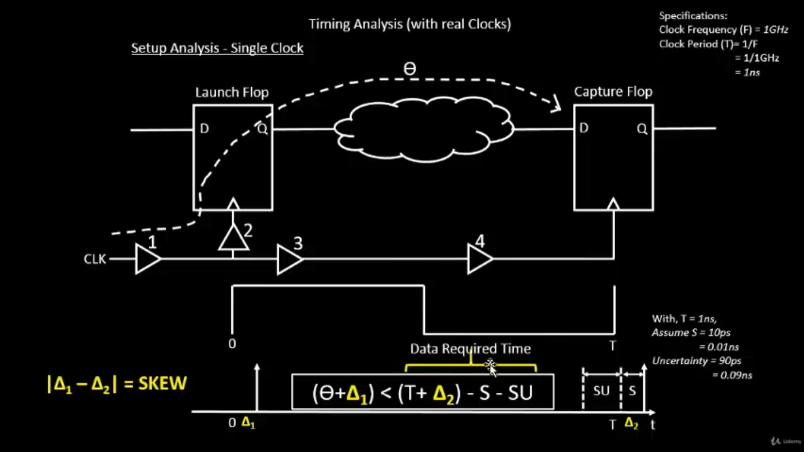

**Hold timing** governs how *early* data is allowed to arrive — data must not race ahead and corrupt the value currently being captured by the same clock edge. This is checked against the circuit's **fastest** realistic corner, since that's when data arrives soonest.

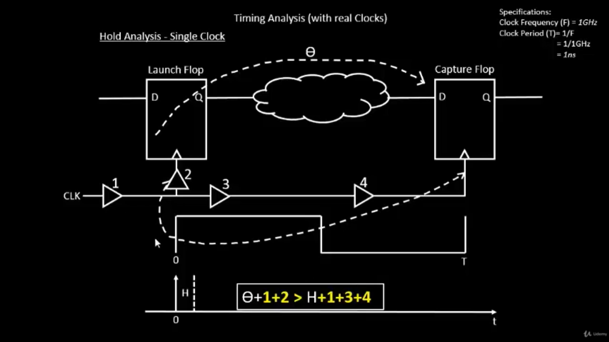

```
Setup Slack = Required Time (max, slow corner) − Data Arrival Time
Hold  Slack = Data Arrival Time − Required Time (min, fast corner)
```

Both slacks need to stay non-negative across every path in the design for it to be considered timing-clean — a design can pass setup comfortably and still fail on hold (or vice versa), which is exactly why both corners are checked independently, as was done in Day 9.

---

## 5. RC Delay Modeling

Every routed wire behaves electrically as a distributed resistance-capacitance (RC) network rather than an ideal, delay-free connection. The standard simplified model used for estimating this delay is the **Elmore delay model**, which treats a wire as a chain of lumped RC segments and computes propagation delay as a function of the resistance and capacitance accumulated along the path from driver to receiver.

This matters directly for routing: a longer or more heavily loaded net doesn't just take up more physical space — it genuinely gets *electrically slower*, which is exactly why RC extraction (introduced in Day 7) needs to happen after routing, using the real, physical wire geometry rather than pre-route estimates.

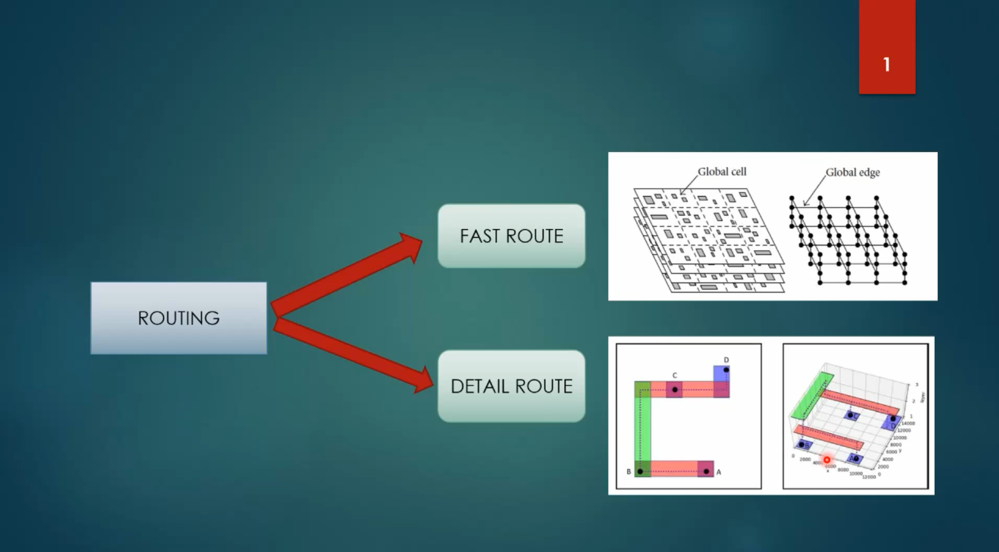

---

## 6. Routing: Global vs. Detailed

Routing is split into two distinct stages, each solving a different part of the wiring problem:

| Stage | What It Does |
|---|---|
| **Global Routing** | Determines approximate paths for every net by dividing the routing area into a coarse grid of regions ("global routing cells" or GCells) and deciding which GCells each net passes through — without committing to exact tracks or layers yet. |
| **Detailed Routing** | Takes each net's global routing solution and converts it into exact physical wires and vias on specific tracks and metal layers, strictly obeying the technology's design rules (spacing, width, via placement). |

Global routing is fast and works at a coarse level specifically so it can consider the *whole design's* wiring and congestion simultaneously; detailed routing is slower and more exacting because it has to guarantee every single wire and via is actually DRC-legal.

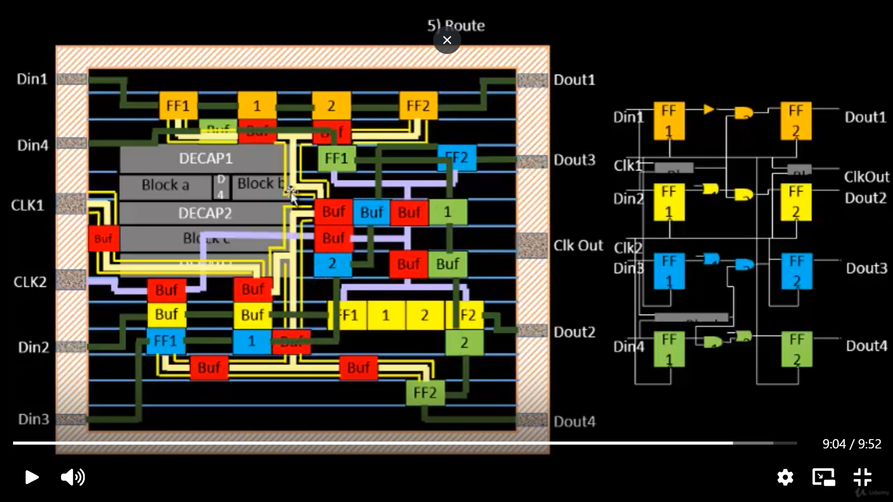
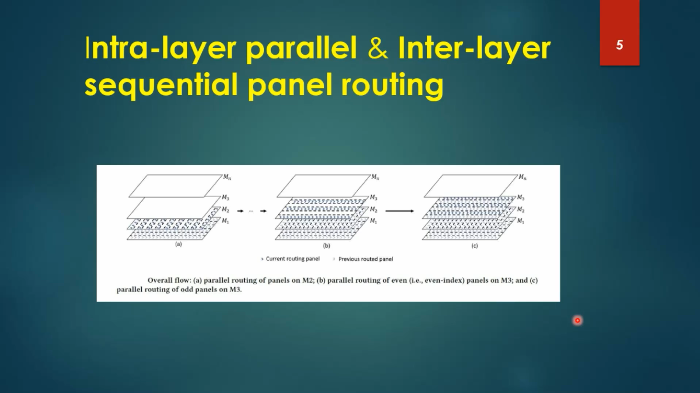

---

## 7. The Maze Routing Algorithm (Lee's Algorithm)

Both global and detailed routing ultimately need to solve the same basic problem: find a valid path between two points on a grid, avoiding obstacles (other wires, blocked cells, existing routing). The classic algorithm for this is **Lee's algorithm**, commonly called **maze routing**.

**How it works, conceptually:**

1. **Wave expansion** — starting from the source point, the algorithm labels every reachable neighboring grid cell with an incrementing distance value (1, 2, 3, …), expanding outward in all directions like a ripple — similar in spirit to a breadth-first search.
2. **Reaching the target** — expansion continues, layer by layer, until the wave reaches the destination point, which gets labeled with its shortest-path distance from the source.
3. **Backtracing** — starting from the destination, the algorithm walks backward through the grid, always stepping to a neighboring cell with a strictly smaller distance label, until it arrives back at the source. This traced-back path is the actual shortest legal route.

```
Step 1: Expand outward from source, labeling reachable cells with distance
Step 2: Continue until target cell is reached
Step 3: Backtrace from target to source via decreasing distance labels
Result: A guaranteed shortest path (in grid steps) between source and target
```

**Why this matters for routing specifically:** Lee's algorithm guarantees finding the shortest path *if one exists*, and naturally routes around obstacles since blocked cells are simply never labeled during wave expansion. Its main drawback is computational cost — a full grid-wide wave expansion for every single net is expensive at real design sizes, which is exactly why practical tools like FastRoute and TritonRoute use maze routing selectively (often just for the hardest, most congested nets) rather than as their only technique.

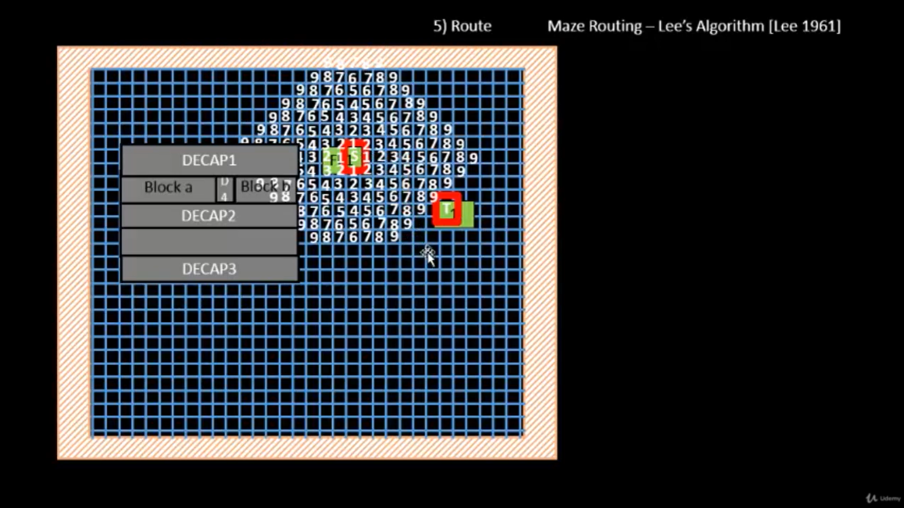

---

## 8. FastRoute — Global Routing in OpenLane

**FastRoute** is the global router used inside the OpenLane flow. It takes the placement result and determines, for every net, an approximate routing path through the design's GCell grid — with the explicit goal of minimizing wirelength while balancing routing congestion across the whole chip.

**Techniques FastRoute combines:**
- **Pattern routing** — for simple, uncongested nets, using fast, direct L-shaped or Z-shaped paths rather than full maze search
- **Monotonic routing** — routing that only moves in one direction (never backtracking) along each axis, which is fast to compute and works well when there's no congestion to route around
- **Selective maze routing** — falling back to a full Lee's-algorithm-style search specifically for nets that pattern/monotonic routing can't resolve cleanly, such as nets crossing heavily congested regions
- **Rectilinear Steiner Minimal Tree (RSMT) construction** — for multi-pin nets (a single driver feeding several loads), FastRoute builds a tree structure connecting all pins with close-to-minimal total wirelength, rather than routing each driver-load pair independently

The output of FastRoute is a global routing solution — which GCells each net passes through — that gets handed off to detailed routing next.

---

## 9. TritonRoute — Detailed Routing in OpenLane

**TritonRoute** takes FastRoute's global routing guide and converts it into the actual, DRC-legal metal geometry — real wires on real tracks, with real vias connecting between layers.

**General flow inside TritonRoute:**
1. **Track assignment** — nets are assigned to specific routing tracks within the coarse regions FastRoute already decided on
2. **Initial detailed routing** — actual wire segments and vias are generated along those assigned tracks
3. **Search and repair** — any resulting DRC violations (spacing, width, via-rule violations) are identified and locally fixed by re-routing just the affected segments, rather than re-running the entire detailed routing pass

This staged approach is what makes detailed routing tractable at real design sizes — solving the *entire* routing problem simultaneously with full DRC awareness would be far too computationally expensive, so TritonRoute narrows the search space using FastRoute's global solution first, then only does expensive local fixups where actually needed.

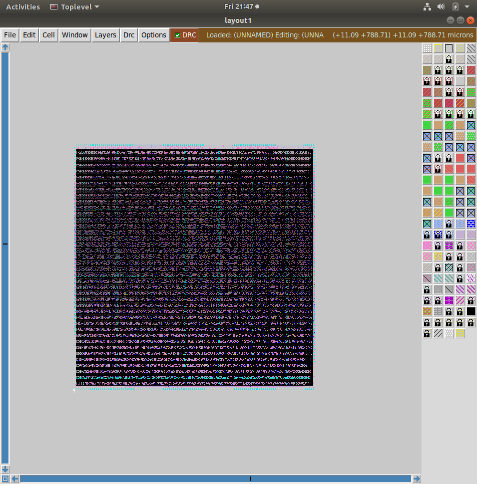
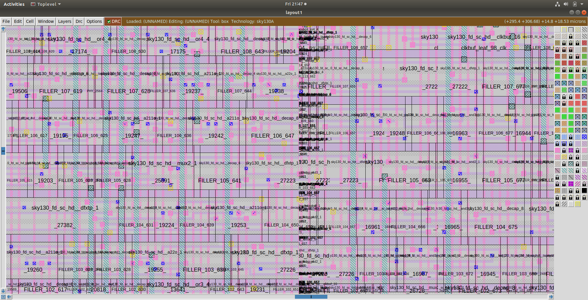

---

## 10. Final PicoRV32a Physical Design Results

With floorplanning, power planning, placement, CTS, and now routing all complete, this section shows the final, fully implemented PicoRV32a design.

**Final synthesized netlist (starting point for this stage):**

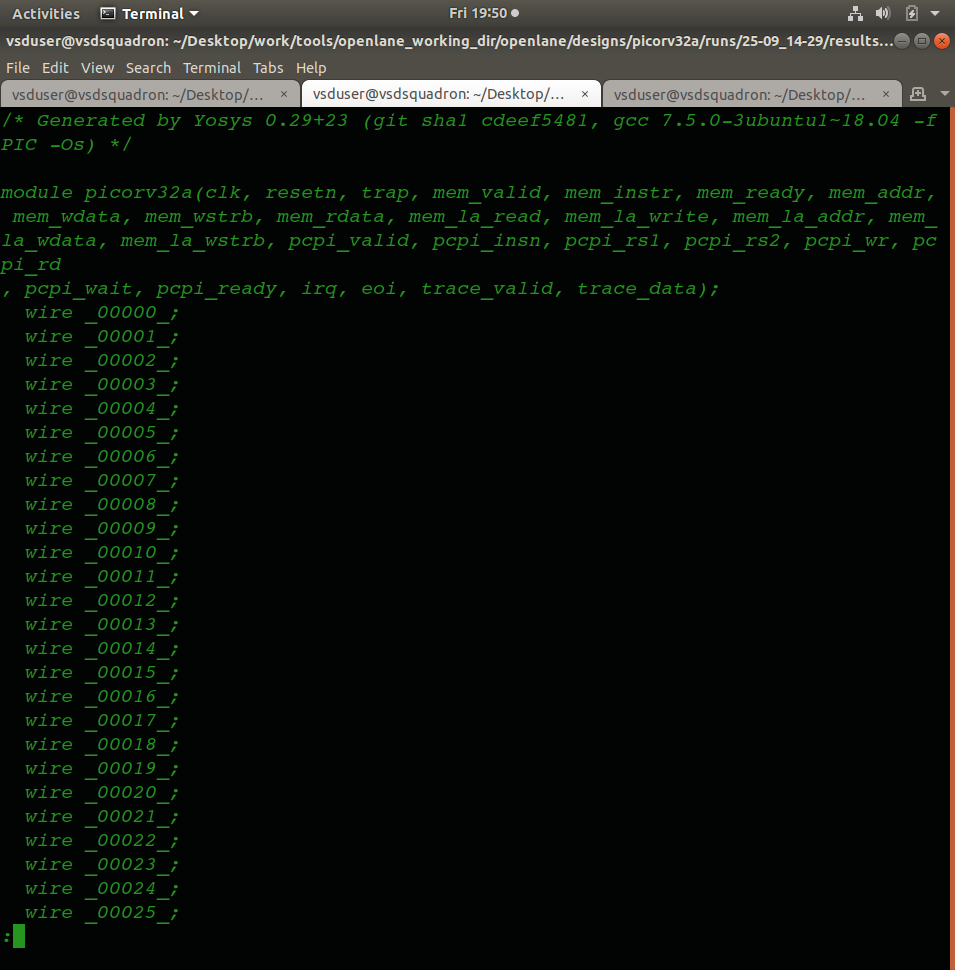

**Final floorplan:**

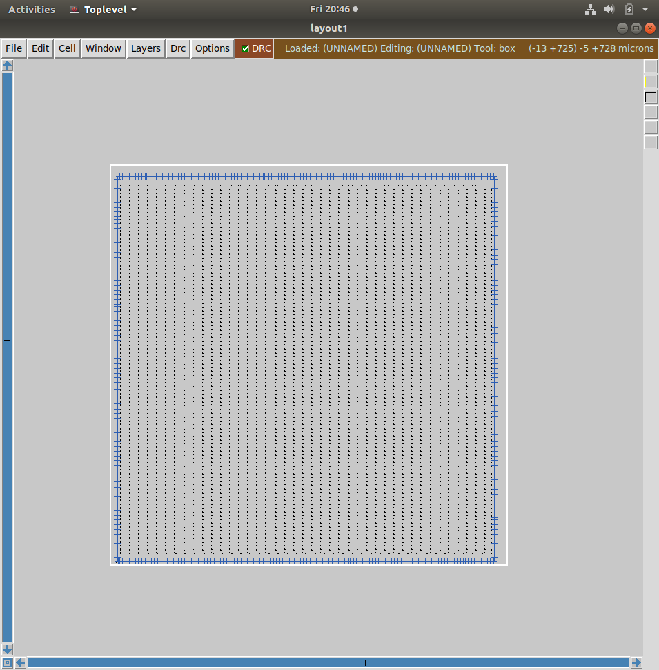

**Final placement (multiple views showing the completed cell arrangement):**

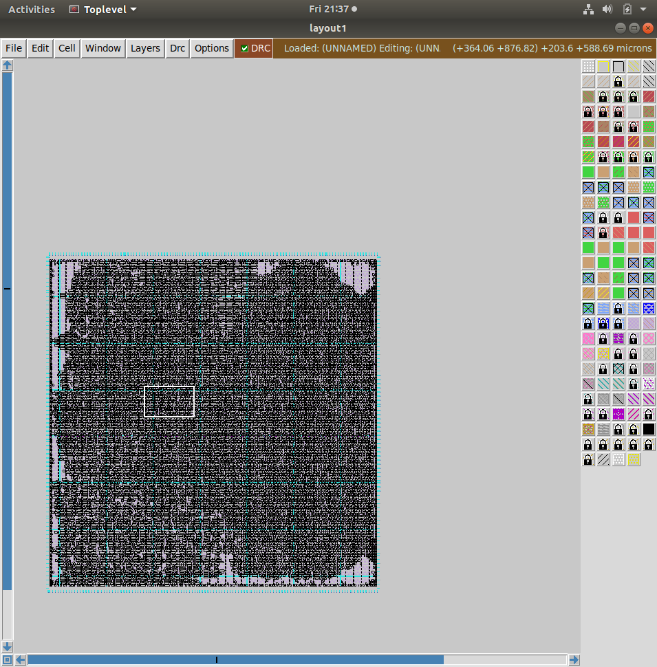
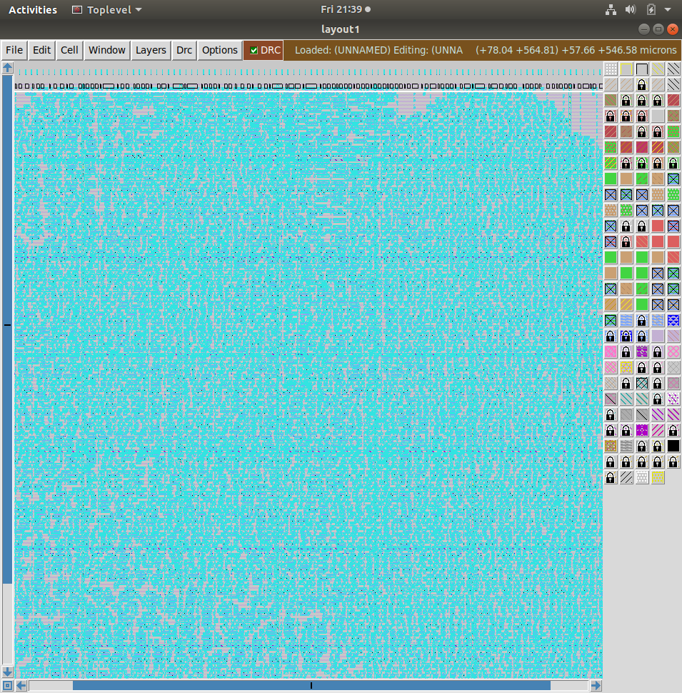
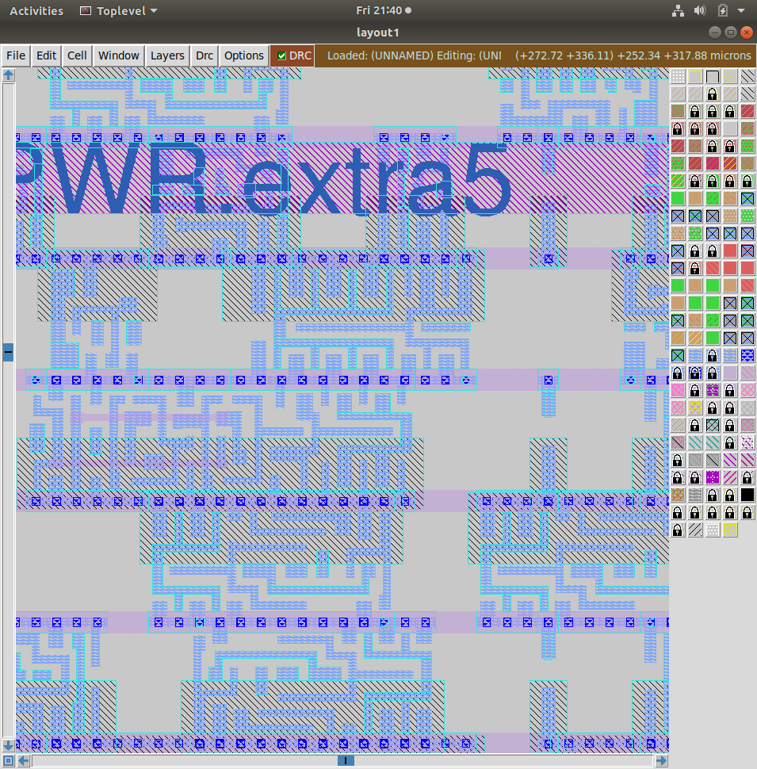

**Completed physical design:**

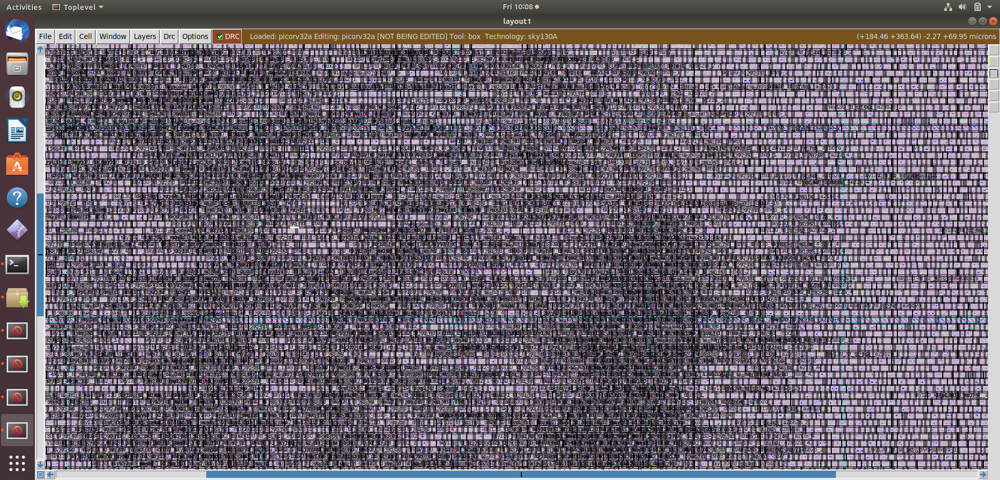

At this point, PicoRV32a has a complete, routed physical implementation — every standard cell placed, every net wired, power distributed throughout the core, and the clock tree built and protected — ready to move into RC extraction, post-route STA, and final physical verification (DRC/LVS) ahead of GDSII generation.

---

## 11. Conclusion

This module closes out the physical design portion of the RTL-to-GDSII workshop by going deep specifically on routing — understanding *why* global and detailed routing are split into separate stages, how Lee's algorithm actually solves the underlying pathfinding problem on a grid, and how FastRoute and TritonRoute apply that theory practically at real design scale inside OpenLane. Revisiting power planning, CTS/clock protection, and setup/hold timing alongside this new material reinforced how interconnected every physical-design stage really is — a routing decision affects IR drop, a placement decision affects routability, and a synthesis-stage buffering choice ultimately shows up in a setup/hold slack number three stages later. Seeing PicoRV32a's floorplan, placement, and routing carried through to a complete, final physical implementation is a genuinely solid capstone to the full RTL-to-GDSII journey covered across this entire workshop.
