# Day 5 – Optimization in Synthesis: If-Else, Case, For Loops & Generate Blocks

## Objective

Day 5 looks at how everyday coding choices in Verilog — the way `if-else` and `case` statements are structured, how loops are used, and how repetitive hardware is generated — directly affect what synthesis produces. The central theme is **incomplete conditional logic**, and how it silently turns combinational designs into something with unintended latches.

---

## Contents

1. [If-Else Statements in Verilog](#1-if-else-statements-in-verilog)
2. [Inferred Latches](#2-inferred-latches)
3. [Labs — If-Else and Case Statements](#3-labs--if-else-and-case-statements)
4. [For Loops in Verilog](#4-for-loops-in-verilog)
5. [Generate Blocks in Verilog](#5-generate-blocks-in-verilog)
6. [Ripple Carry Adder (RCA)](#6-ripple-carry-adder-rca)
7. [Labs — Loops and Generate Blocks](#7-labs--loops-and-generate-blocks)
8. [Conclusion](#8-conclusion)

---

## 1. If-Else Statements in Verilog

`if-else` is used inside procedural blocks (`always`, `initial`, tasks, functions) to describe conditional behavior.

```verilog
if (condition) begin
    // executes when condition is true
end else begin
    // executes when condition is false
end
```

The `else` branch is optional — but as Section 2 shows, leaving it out in combinational logic isn't just a style choice, it changes what hardware gets inferred.

**Nested form:**

```verilog
if (condition1) begin
    // ...
end else if (condition2) begin
    // ...
end else begin
    // ...
end
```

---

## 2. Inferred Latches

A latch gets inferred whenever a combinational `always` block doesn't assign a value to a signal on *every* possible path through the logic. Since the tool has no idea what that signal should do in the unhandled case, it infers a latch to "hold" the previous value — which is almost never what was intended for pure combinational logic.

```verilog
module ex (
    input wire a, b, sel,
    output reg y
);
    always @ (a, b, sel) begin
        if (sel == 1'b1)
            y = a;   // no else — y is undefined when sel = 0
    end
endmodule
```

**The fix** is simply to make sure every branch is covered — either with an explicit `else`, or a `default` case:

```verilog
module ex (
    input wire a, b, sel,
    output reg y
);
    always @ (a, b, sel) begin
        case (sel)
            1'b1    : y = a;
            default : y = 1'b0;   // covers the missing case
        endcase
    end
endmodule
```

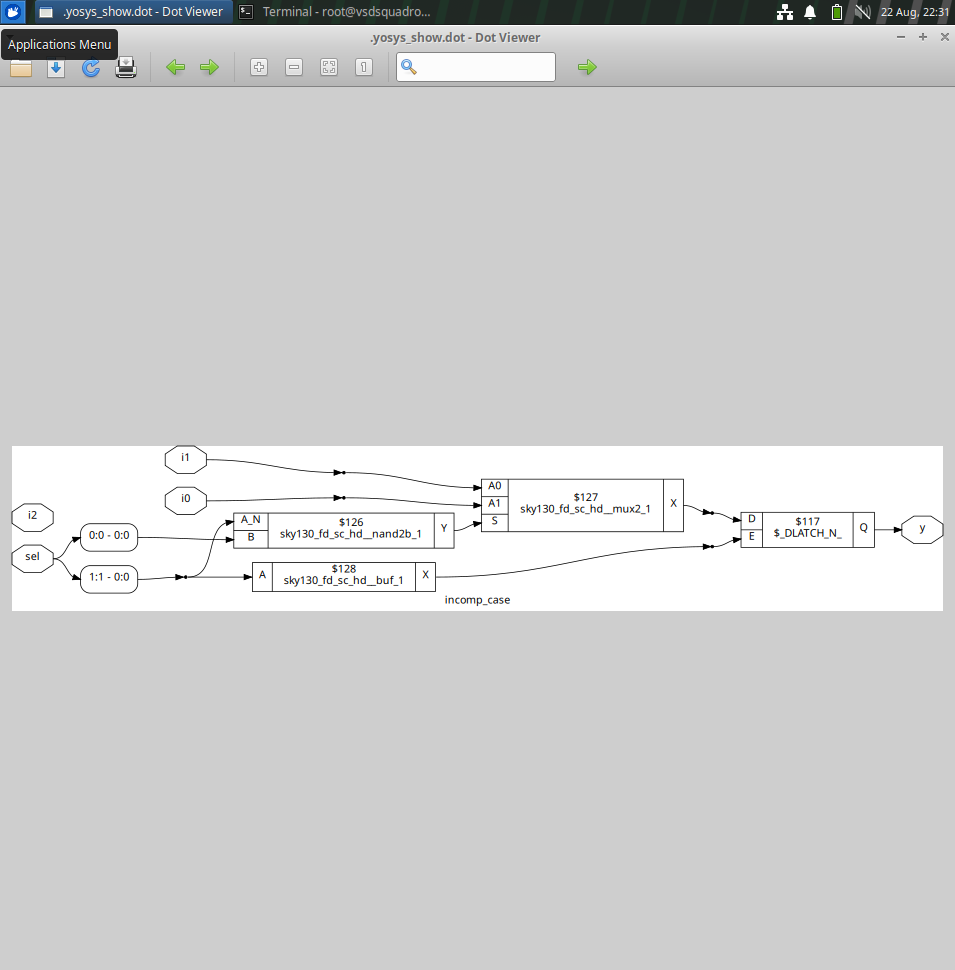
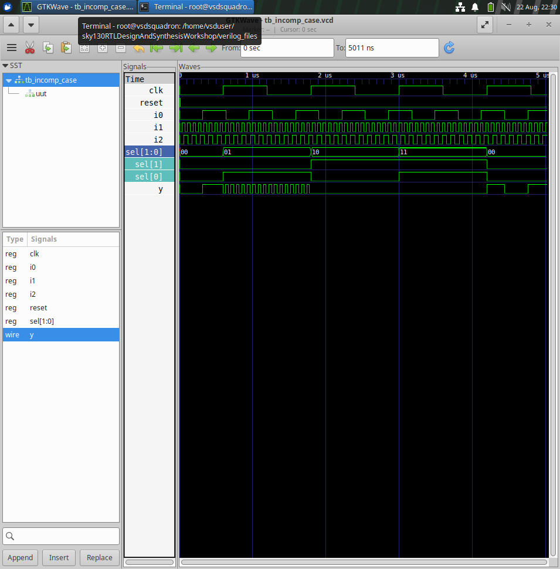

---

## 3. Labs — If-Else and Case Statements

### Lab 1 — Incomplete If Statement

```verilog
module incomp_if (input i0, input i1, input i2, output reg y);
    always @ (*) begin
        if (i0)
            y <= i1;
    end
endmodule
```

No `else` branch means `y` is unassigned when `i0 = 0` — a textbook latch-inference case.

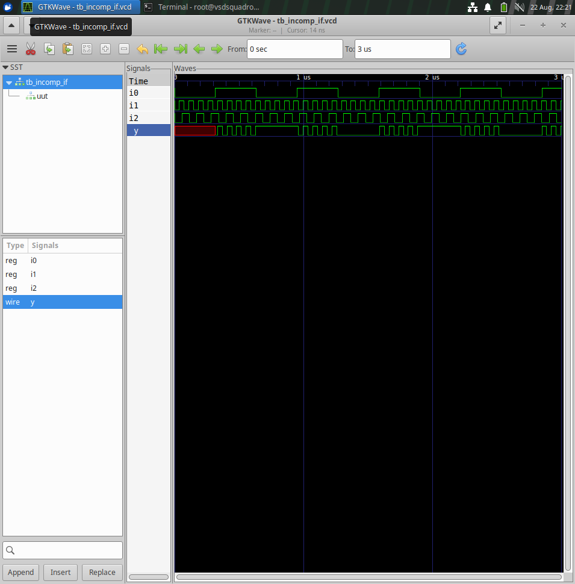

### Lab 2 — Synthesis Result of Lab 1

Synthesizing `incomp_if` confirms the tool infers a latch to hold `y`'s value when `i0 = 0`, exactly as expected from incomplete branch coverage.

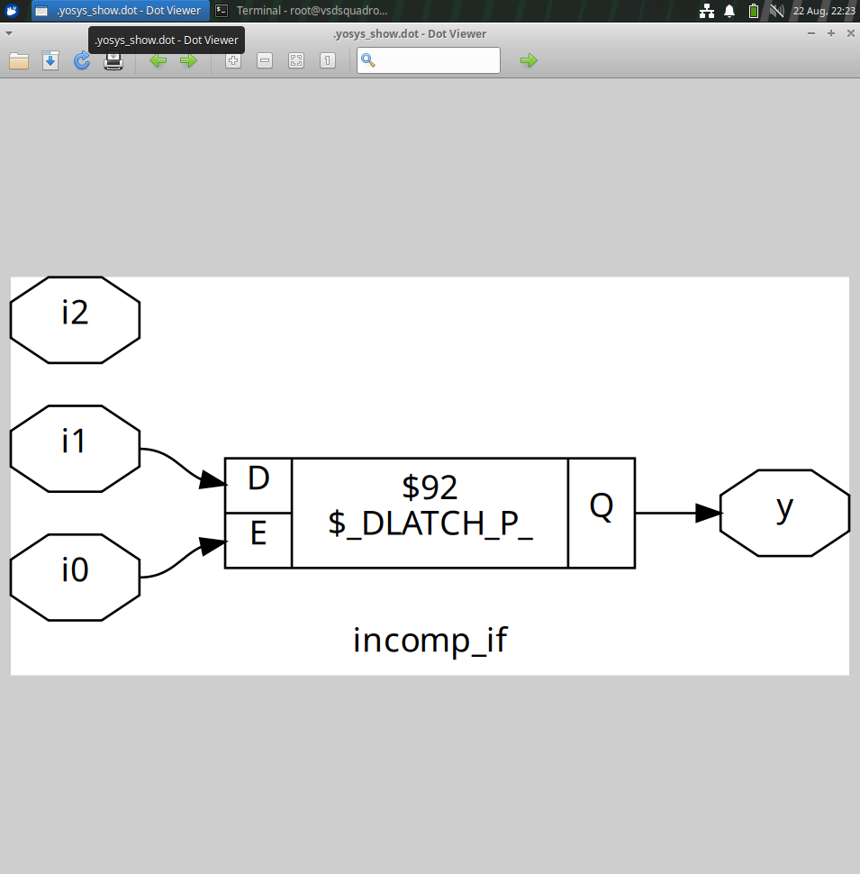

### Lab 3 — Nested If-Else (Still Incomplete)

```verilog
module incomp_if2 (input i0, input i1, input i2, input i3, output reg y);
    always @ (*) begin
        if (i0)
            y <= i1;
        else if (i2)
            y <= i3;
    end
endmodule
```

Even with two conditions handled, there's still no final `else` — if both `i0` and `i2` are false, `y` is left unassigned.

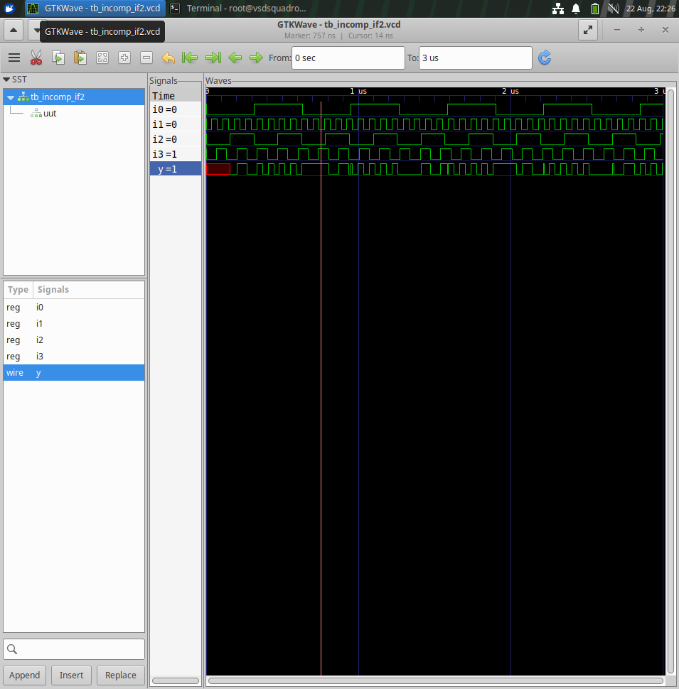

### Lab 4 — Synthesis Result of Lab 3

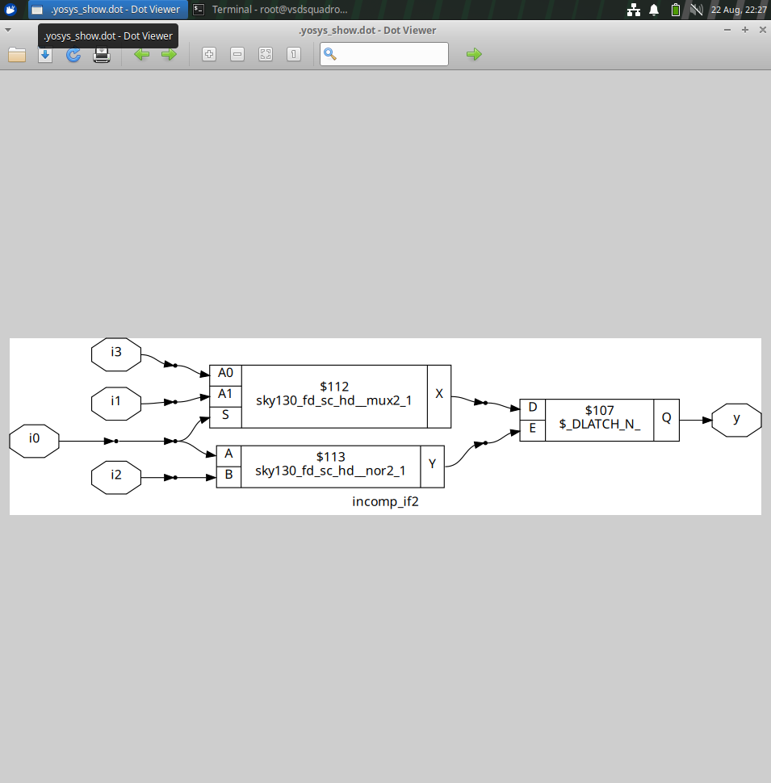

### Lab 5 — Complete Case Statement

```verilog
module comp_case (input i0, input i1, input i2, input [1:0] sel, output reg y);
    always @ (*) begin
        case (sel)
            2'b00   : y = i0;
            2'b01   : y = i1;
            default : y = i2;
        endcase
    end
endmodule
```

The `default` branch guarantees every possible value of `sel` is covered — no latch inferred.

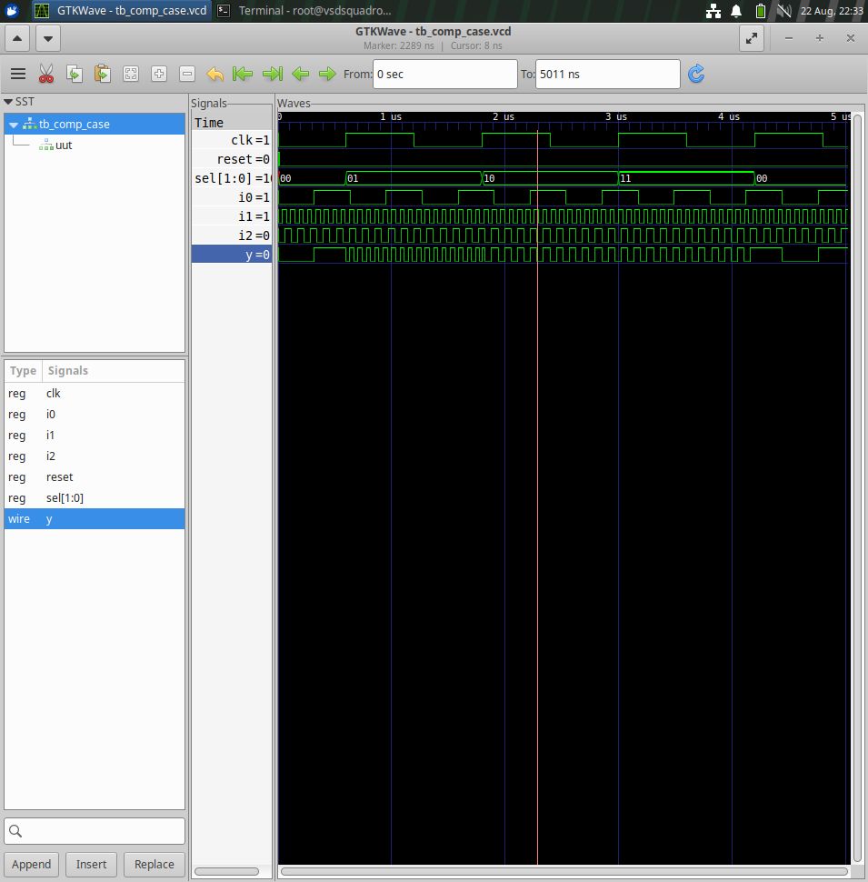

### Lab 6 — Synthesis Result of Lab 5

Clean combinational mux logic, with no inferred latch — confirming that full case coverage produces exactly the hardware intended.

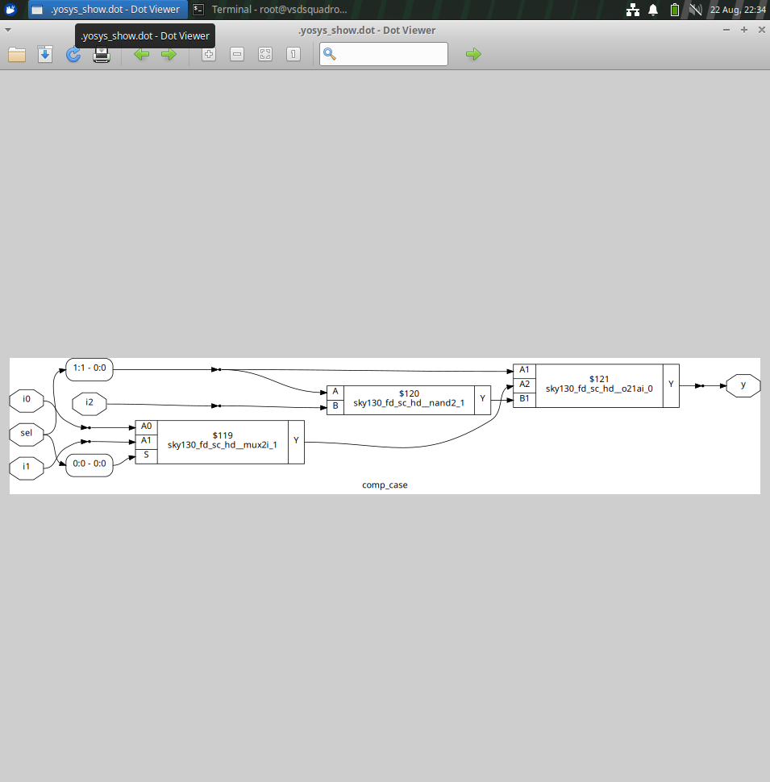

### Lab 7 — Incomplete Case Handling

```verilog
module bad_case (
    input i0, input i1, input i2, input i3,
    input [1:0] sel,
    output reg y
);
    always @ (*) begin
        case (sel)
            2'b00 : y = i0;
            2'b01 : y = i1;
            2'b10 : y = i2;
            2'b1? : y = i3;   // wildcard — easy to misjudge actual coverage
        endcase
    end
endmodule
```

The `?` wildcard can look like it covers everything, but it's worth double-checking exactly which `sel` patterns are actually matched — wildcard cases are a common source of accidentally-incomplete logic that isn't obvious at a glance.

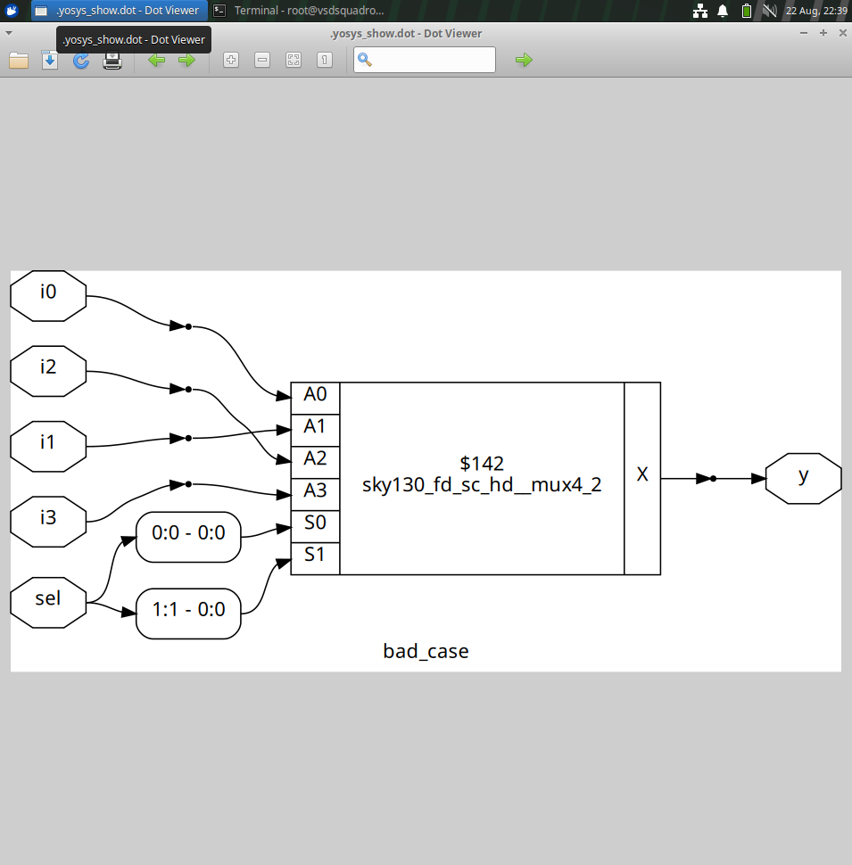
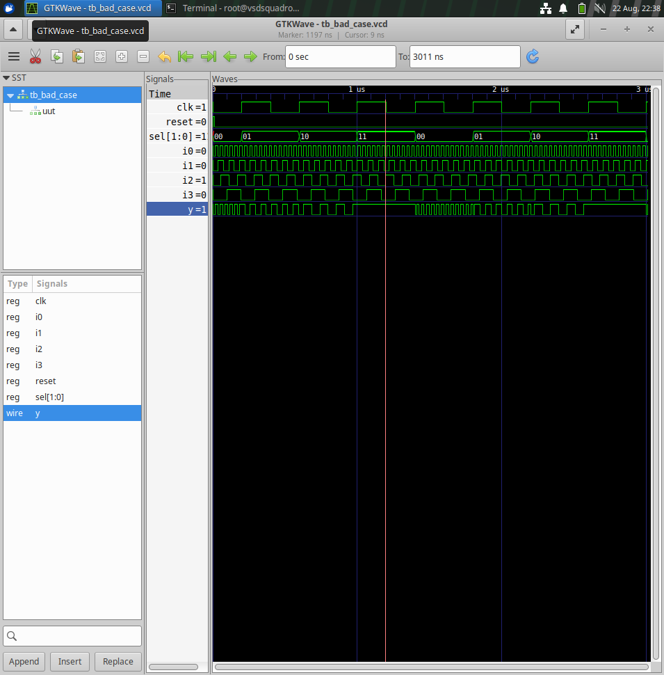

### Lab 8 — Partial Assignments Inside a Case

```verilog
module partial_case_assign (
    input i0, input i1, input i2,
    input [1:0] sel,
    output reg y, output reg x
);
    always @ (*) begin
        case (sel)
            2'b00: begin
                y = i0;
                x = i2;
            end
            2'b01: y = i1;   // x not assigned here
            default: begin
                x = i1;
                y = i2;
            end
        endcase
    end
endmodule
```

This is a subtler version of the same problem — `y` is fully covered, but `x` is only assigned in two of the three branches. Since `x` isn't touched in the `2'b01` case, a latch gets inferred for `x` specifically, even though `y` synthesizes cleanly. It's a good reminder to check *every output signal* for complete coverage, not just the block as a whole.

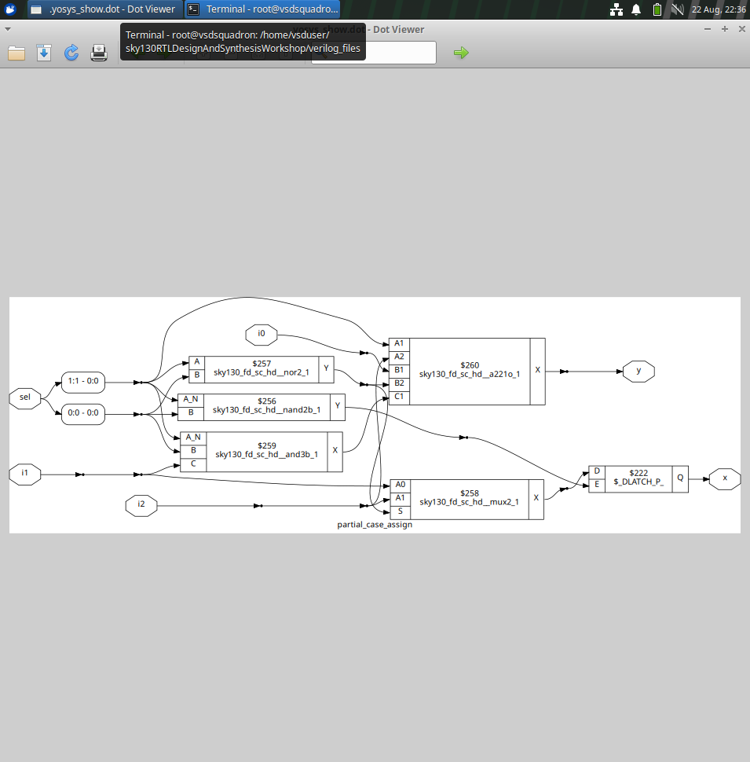

*(Lab setup and synthesis steps follow the same flow introduced in Day 1.)*

---

## 4. For Loops in Verilog

A `for` loop inside a procedural block repeats a set of statements based on a loop counter — useful for writing compact, scalable code instead of repeating similar lines manually.

```verilog
for (initialization; condition; increment) begin
    // statements
end
```

**Important constraint:** for a `for` loop to be synthesizable, the number of iterations must be fixed at compile time — this is a loop that gets "unrolled" into repeated hardware, not a runtime loop the way software loops work.

**Example — 4:1 MUX using a for loop:**

```verilog
module mux_4to1_for_loop (
    input wire [3:0] data,
    input wire [1:0] sel,
    output reg y
);
    integer i;
    always @ (data, sel) begin
        y = 1'b0;
        for (i = 0; i < 4; i = i + 1) begin
            if (i == sel)
                y = data[i];
        end
    end
endmodule
```

---

## 5. Generate Blocks in Verilog

A `generate` block, combined with a `genvar` and a `for` loop, creates repeated hardware structures — like multiple instances of the same module — at compile time rather than writing each instance out manually.

```verilog
genvar i;
generate
    for (i = 0; i < 4; i = i + 1) begin : gen_loop
        and_gate and_inst (.a(in[i]), .b(in[i+1]), .y(out[i]));
    end
endgenerate
```

This is especially useful for structurally repetitive hardware — like the adder chain below.

---

## 6. Ripple Carry Adder (RCA)

A Ripple Carry Adder builds an *n*-bit adder out of *n* single-bit full adders chained together — each stage's carry-out feeds directly into the next stage's carry-in, with the carry "rippling" through the chain.

---

## 7. Labs — Loops and Generate Blocks

### Lab 9 — 4:1 MUX Using a For Loop

```verilog
module mux_generate (
    input i0, input i1, input i2, input i3,
    input [1:0] sel,
    output reg y
);
    wire [3:0] i_int;
    assign i_int = {i3, i2, i1, i0};
    integer k;
    always @ (*) begin
        for (k = 0; k < 4; k = k + 1) begin
            if (k == sel)
                y = i_int[k];
        end
    end
endmodule
```

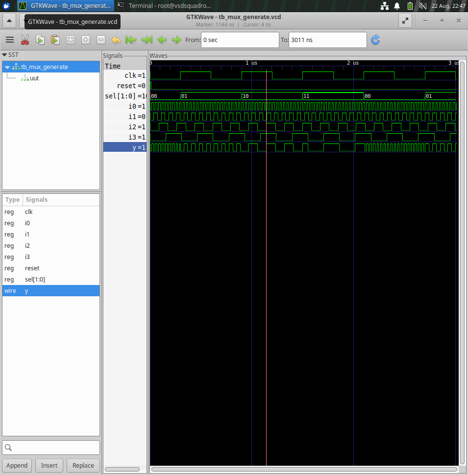

### Lab 10 — 8:1 Demux Using a Case Statement

```verilog
module demux_case (
    output o0, output o1, output o2, output o3,
    output o4, output o5, output o6, output o7,
    input [2:0] sel,
    input i
);
    reg [7:0] y_int;
    assign {o7, o6, o5, o4, o3, o2, o1, o0} = y_int;
    always @ (*) begin
        y_int = 8'b0;
        case (sel)
            3'b000 : y_int[0] = i;
            3'b001 : y_int[1] = i;
            3'b010 : y_int[2] = i;
            3'b011 : y_int[3] = i;
            3'b100 : y_int[4] = i;
            3'b101 : y_int[5] = i;
            3'b110 : y_int[6] = i;
            3'b111 : y_int[7] = i;
        endcase
    end
endmodule
```

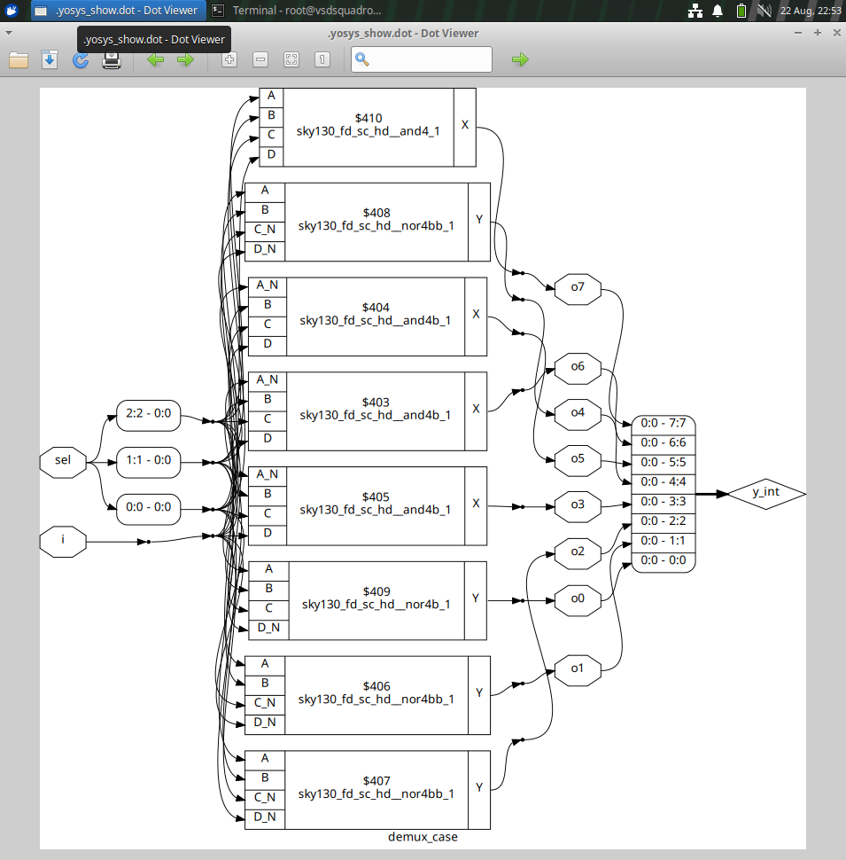
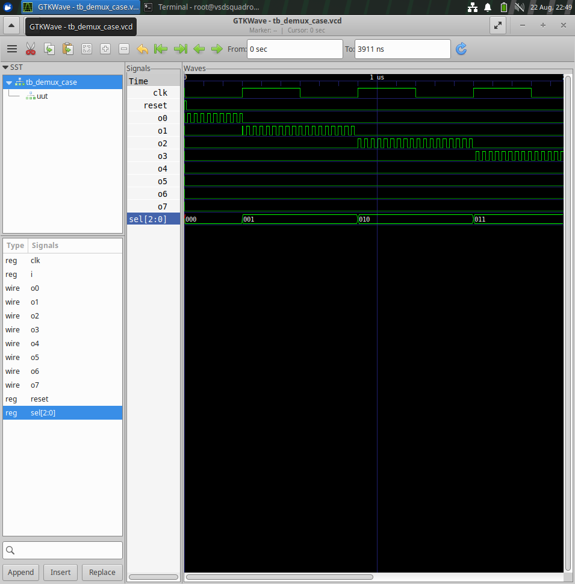

### Lab 11 — 8:1 Demux Using a For Loop

```verilog
module demux_generate (
    output o0, output o1, output o2, output o3,
    output o4, output o5, output o6, output o7,
    input [2:0] sel,
    input i
);
    reg [7:0] y_int;
    assign {o7, o6, o5, o4, o3, o2, o1, o0} = y_int;
    integer k;
    always @ (*) begin
        y_int = 8'b0;
        for (k = 0; k < 8; k = k + 1) begin
            if (k == sel)
                y_int[k] = i;
        end
    end
endmodule
```

Functionally identical to Lab 10, but the for-loop version scales far better — extending this to a 16:1 or 32:1 demux means changing a loop bound and a bus width, rather than writing out every `case` branch by hand.

### Lab 12 — 8-bit Ripple Carry Adder Using a Generate Block

```verilog
module rca (
    input  [7:0] num1,
    input  [7:0] num2,
    output [8:0] sum
);
    wire [7:0] int_sum;
    wire [7:0] int_co;

    genvar i;
    generate
        for (i = 1; i < 8; i = i + 1) begin
            fa u_fa_1 (.a(num1[i]), .b(num2[i]), .c(int_co[i-1]), .co(int_co[i]), .sum(int_sum[i]));
        end
    endgenerate

    fa u_fa_0 (.a(num1[0]), .b(num2[0]), .c(1'b0), .co(int_co[0]), .sum(int_sum[0]));

    assign sum[7:0] = int_sum;
    assign sum[8]   = int_co[7];
endmodule
```

**Full adder building block:**

```verilog
module fa (input a, input b, input c, output co, output sum);
    assign {co, sum} = a + b + c;
endmodule
```

`u_fa_0` handles bit 0 with a hardwired carry-in of `0`, while the `generate` loop instantiates the remaining 7 full adders, wiring each one's carry-out into the next stage's carry-in — exactly the ripple-carry structure described above, built without manually writing out all 8 instances.


*(Lab setup and synthesis steps follow the same flow introduced in Day 1.)*

---

## 8. Conclusion

Day 5 tied together two related ideas: **incomplete logic causes unintended latches** (Labs 1–8), and **loops/generate blocks let scalable hardware be described concisely** (Labs 9–12). The if-else/case labs in particular reinforced a habit worth carrying forward — always double-check that *every* output signal is assigned on *every* possible branch of a combinational block, since even a single missed path (as in Lab 8) is enough to introduce a latch that's easy to miss just by reading the code. Combined with `generate` blocks for structurally repetitive designs like the RCA, this rounds out the core RTL coding practices this workshop set out to build.
