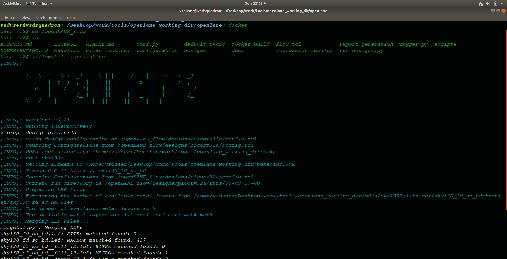
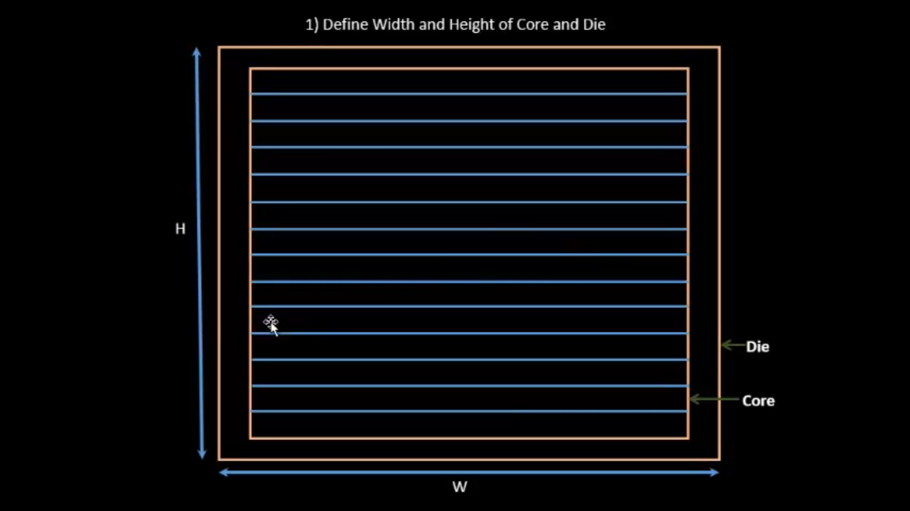
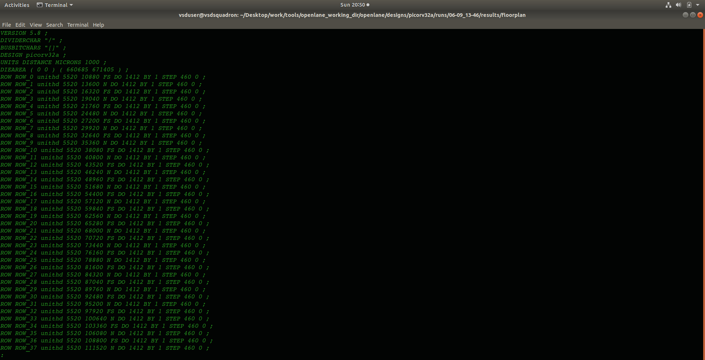
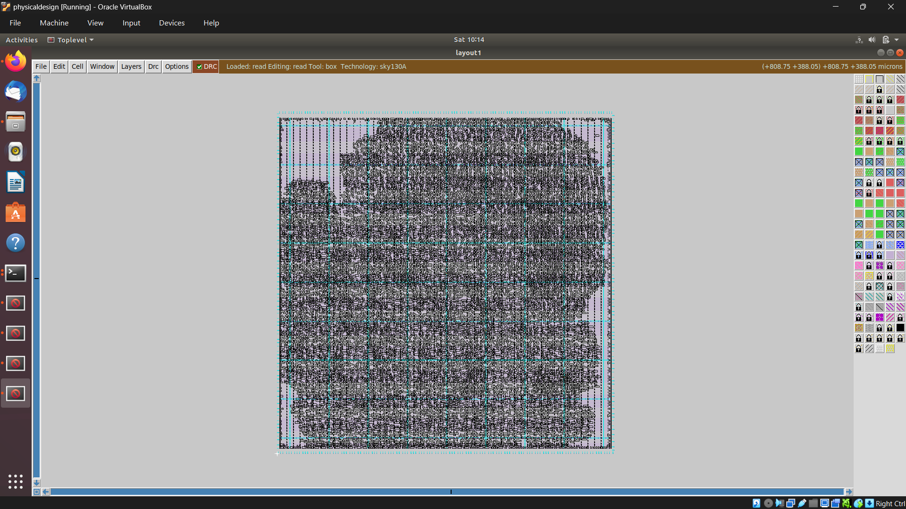
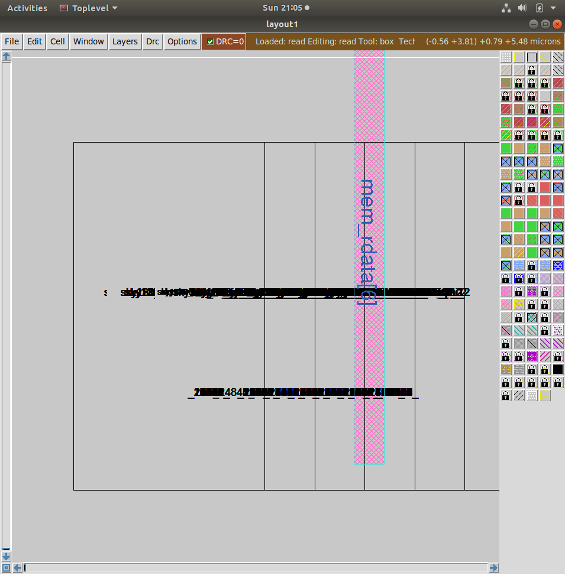
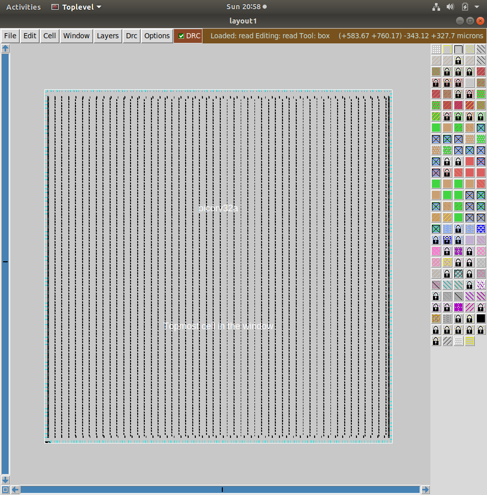
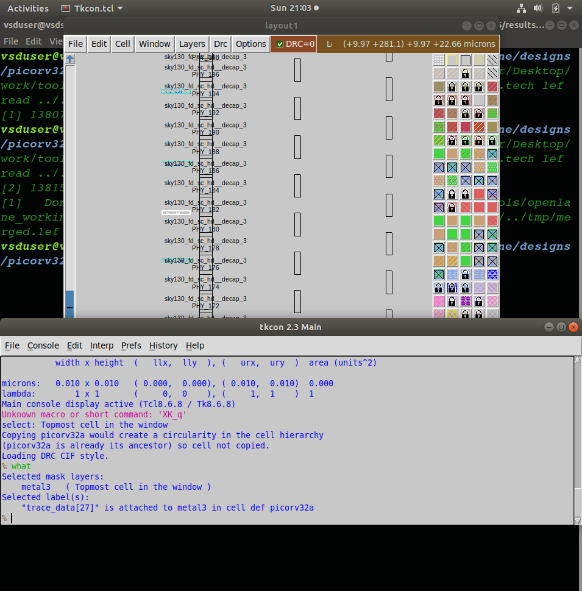

# Day 7 – OpenLane Physical Design: Floorplan, Placement & Power Distribution

## Objective

Day 7 moves into the physical design portion of the RTL-to-GDSII flow, running OpenLane's synthesis → floorplan → placement stages on PicoRV32 with the SKY130 PDK, then inspecting the generated layout in Magic. Alongside the hands-on flow, this session covers what core/die actually mean physically, how floorplan parameters (utilization, aspect ratio) shape the design, why a power distribution network is necessary at all, and how decoupling capacitors fit into that picture.

---

## Contents

1. [Where This Fits in the Flow](#1-where-this-fits-in-the-flow)
2. [Launching OpenLane](#2-launching-openlane)
3. [Running Synthesis](#3-running-synthesis)
4. [Core and Die](#4-core-and-die)
5. [Floorplanning](#5-floorplanning)
6. [Placement](#6-placement)
7. [Viewing the Layout in Magic](#7-viewing-the-layout-in-magic)
8. [Power Distribution Network](#8-power-distribution-network)
9. [Decoupling Capacitors](#9-decoupling-capacitors)
10. [Command Reference](#10-command-reference)
11. [Conclusion](#11-conclusion)

---

## 1. Where This Fits in the Flow

```
RTL → Synthesis → Floorplan → Placement → Power Distribution
    → Clock Tree Synthesis → Routing → Physical Verification → GDSII
```

Today's practical work covers synthesis through placement, plus building an understanding of how power gets distributed across the die — routing, CTS, and final verification come later.

---

## 2. Launching OpenLane

OpenLane runs inside a Docker container, with the PDK and working directory mounted into it:

```bash
cd ~/Desktop/work/tools/openlane_working_dir/openlane
echo $PDK_ROOT
unalias docker

docker run -it -v $(pwd):/openLANE_flow -v $PDK_ROOT:$PDK_ROOT \
  -e PDK_ROOT=$PDK_ROOT -u $(id -u $USER):$(id -g $USER) \
  efabless/openlane:v0.21
```

`PDK_ROOT` just needs to point to wherever the SKY130 PDK is installed — the Docker command mounts both the flow directory and that PDK path so the container can see everything it needs.

Once inside, OpenLane is started in **interactive mode**, which runs each flow stage individually instead of firing off the entire RTL-to-GDSII pipeline in one shot — useful for actually inspecting intermediate results:

```bash
cd /openLANE_flow
./flow.tcl -interactive
prep -design <design_name>
```

`prep` loads the RTL, design config, PDK data, and standard-cell/timing libraries needed for everything that follows.



---

## 3. Running Synthesis

```
run_synthesis
```

This converts the RTL into a gate-level netlist mapped onto SKY130 standard cells — the same synthesis concepts from earlier days (Yosys + ABC), just now running as one stage inside the OpenLane flow rather than manually.

**Flip-flop percentage from this run:**

| Metric | Value |
|---|---|
| Flip-flops | 1613 |
| Total cells | 14876 |
| FF percentage | (1613 / 14876) × 100 ≈ **10.84%** |

This roughly quantifies how much of PicoRV32's synthesized logic is sequential (state-holding) versus combinational — useful context for later timing and power analysis.

---

## 4. Core and Die

- **Die** — the entire physical silicon area of the chip, including the core, I/O regions, and power structures.
- **Core** — the inner region where standard cells actually get placed.

```
+------------------------------------------+
|                   DIE                    |
|   +------------------------------------+  |
|   |               CORE                 |  |
|   |     Standard Cells / Routing /     |  |
|   |         Power Distribution         |  |
|   +------------------------------------+  |
+------------------------------------------+
```

There's deliberate space between core and die boundary — that margin is needed for I/O-related structures and power routing that doesn't belong inside the active cell area.



---

## 5. Floorplanning

```
run_floorplan
```

Floorplanning sets up the chip's basic physical shape: die/core dimensions, utilization, aspect ratio, margins, and how much space is reserved for later routing and power structures. Get this stage wrong and everything downstream suffers — routing congestion, long interconnects, timing failures, and poor use of silicon area.

**Core utilization used:** `FP_CORE_UTIL = 35` → **35%** of the core area is targeted for standard cells, leaving the remaining 65% as whitespace for routing, power structures, clock buffers, decaps, and general placement flexibility. Push utilization too high and there simply isn't enough physical room left to route everything cleanly.

**Aspect ratio used:** `1` → width ≈ height, producing an approximately square core.

**Die area, calculated from the generated DEF:**

```
UNITS DISTANCE MICRONS 1000 ;
DIEAREA ( 0 0 ) ( 660805 671405 )
```

With 1000 database units = 1 micron:

```
Width  = 660805 / 1000  = 660.805 µm
Height = 671405 / 1000  = 671.405 µm
Area   = 660.805 × 671.405 ≈ 443,667.78 µm²  (≈ 0.44367 mm²)
```




---

## 6. Placement

```
run_placement
```

Placement takes the synthesized netlist — which only describes logical connections between cells — and assigns each one an actual X/Y position inside the core:

```
Synthesized Netlist → Standard Cells → Physical (X, Y) Locations
```

The placer balances cell density, timing, wirelength, routing congestion, and power while deciding where everything goes. Bad placement shows up later as longer wires, added delay, congestion, and timing violations — so this stage has outsized influence on everything that follows.



---

## 7. Viewing the Layout in Magic

Once floorplan/placement outputs exist, the physical layout can be opened directly in Magic:

```bash
magic -T /home/vsduser/Desktop/work/tools/openlane_working_dir/pdks/sky130A/libs.tech/magic/sky130A.tech \
  lef read ../../tmp/merged.lef \
  lef def read picorv32a.floorplan.def &
```

- `-T sky130A.tech` — loads the SKY130 technology file so Magic interprets the layers correctly
- `lef read ../../tmp/merged.lef` — loads the merged LEF (cell dimensions, pins, metal layers, routing abstracts)
- `lef def read picorv32a.floorplan.def` — loads the actual physical implementation (die area, cell placement, nets, coordinates)
- trailing `&` — runs Magic in the background so the terminal stays free





---

## 8. Power Distribution Network

Every standard cell needs a reliable VDD/GND connection. Power wires have resistance, so current flowing through them causes a voltage drop:

```
Voltage Drop = Current × Resistance   (IR drop)
```

Cells far from the power source can see a bigger drop if the network is poorly designed — which risks unreliable or incorrect cell behavior. A **Power Distribution Network (PDN)** solves this with rings, straps, and rails that give current multiple paths to reach every cell, reducing effective resistance:

```
Power Source → Power Ring → Power Mesh/Straps → Standard Cell Rails → Individual Cells
```

**Power mesh parameters used in this design:**

| Parameter | Value |
|---|---|
| Core ring offset | 6 |
| Core ring spacing | 1.7 |
| Core ring width | 1.6 |
| Lower metal layer | met4 |
| Upper metal layer | met5 |
| Rail layer | met1 |
| Rail width | 0.48 |
| Pitch | 153.18 |
| Horizontal spacing | 1.7 |
| Vertical spacing | 1.7 |
| Vertical width | 1.6 |

Higher metal layers (met4/met5) carry power efficiently over longer distances; met1 handles the fine-grained connection into individual standard-cell rows.

---

## 9. Decoupling Capacitors

When many cells switch simultaneously, current demand spikes suddenly — faster than the PDN's inherent resistance/inductance can always respond to, causing a brief local voltage dip.

```
Sudden switching → current spike → local supply disturbance → decap discharges → disturbance absorbed
```

A decoupling capacitor sits close to the cells as a small local charge reservoir, releasing stored charge to smooth out that momentary dip. **Power mesh and decaps solve different problems** — the mesh handles steady-state distribution across the whole chip, decaps handle fast, local, transient demand. Both are needed together for a genuinely stable supply.

---

## 10. Command Reference

| Step | Command |
|---|---|
| Enter OpenLane directory | `cd ~/Desktop/work/tools/openlane_working_dir/openlane` |
| Check PDK path | `echo $PDK_ROOT` |
| Remove Docker alias | `unalias docker` |
| Start OpenLane container | `docker run -it -v $(pwd):/openLANE_flow -v $PDK_ROOT:$PDK_ROOT -e PDK_ROOT=$PDK_ROOT -u $(id -u $USER):$(id -g $USER) efabless/openlane:v0.21` |
| Enter flow directory | `cd /openLANE_flow` |
| Start interactive mode | `./flow.tcl -interactive` |
| Prepare design | `prep -design <design_name>` |
| Run synthesis | `run_synthesis` |
| Run floorplan | `run_floorplan` |
| Run placement | `run_placement` |
| View layout in Magic | `magic -T <tech_file> lef read <merged.lef> lef def read <design>.floorplan.def &` |

---

## 11. Conclusion

Day 7 turned the abstract RTL-to-GDSII diagram from Day 6 into something tangible — actually running synthesis, floorplan, and placement on PicoRV32 through OpenLane, and seeing the resulting die/core dimensions, cell placement, and utilization numbers instead of just reading about them. The die area calculation from raw DEF coordinates, the 10.84% flip-flop ratio, and the 35% core utilization all reinforced that floorplan decisions aren't arbitrary — they're deliberate trade-offs between cell density, routability, and power delivery. Understanding *why* a PDN and decoupling capacitors both exist — steady-state distribution versus transient local support — rounds out the physical-design picture heading into clock tree synthesis and routing next.
