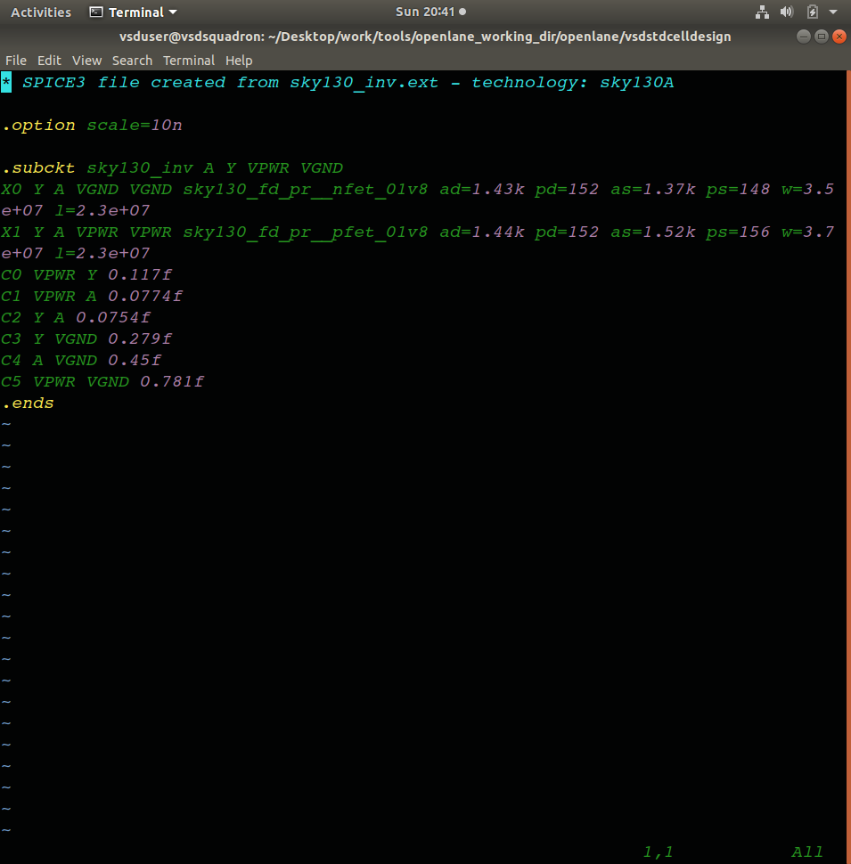
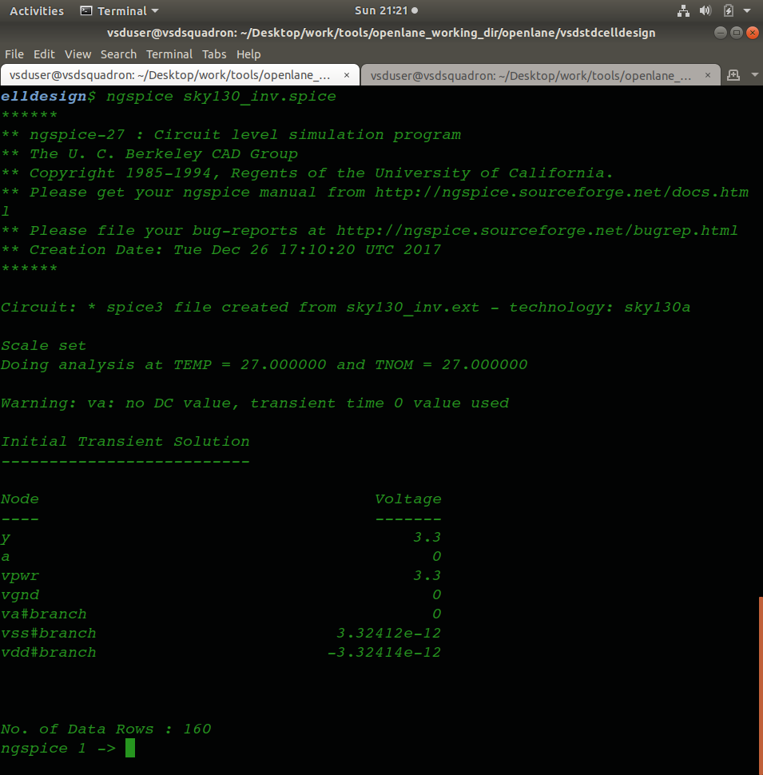
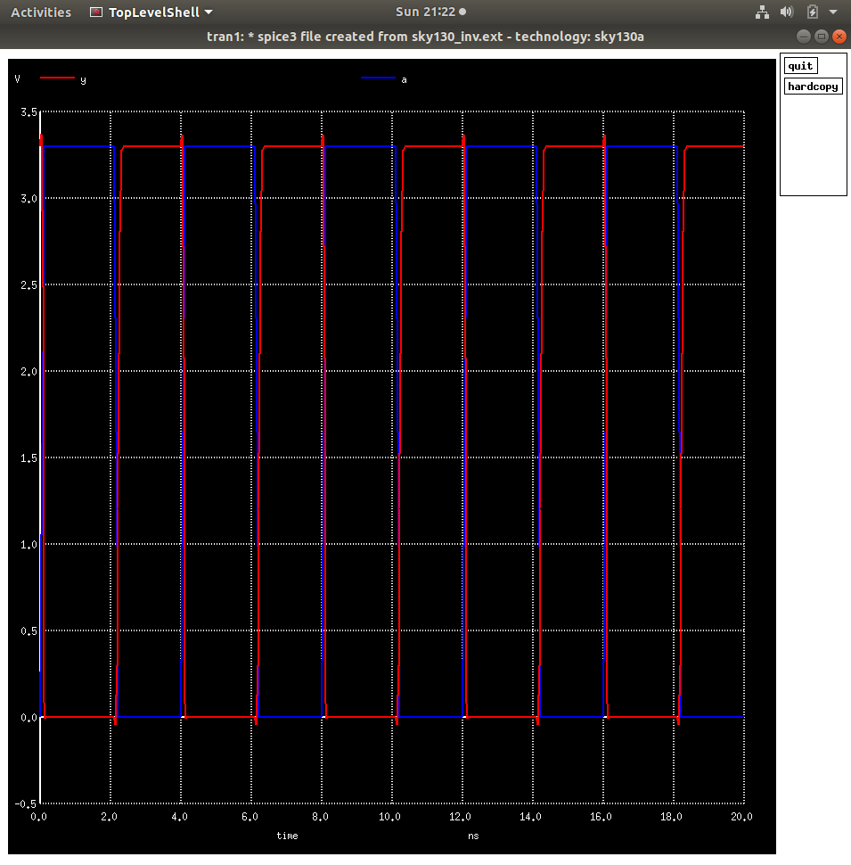
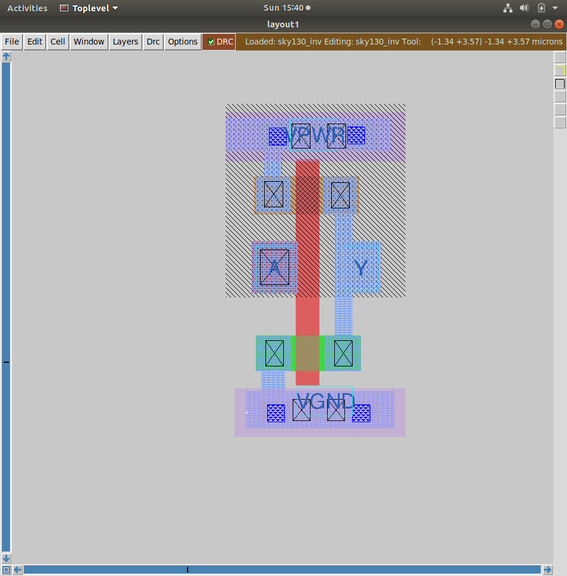
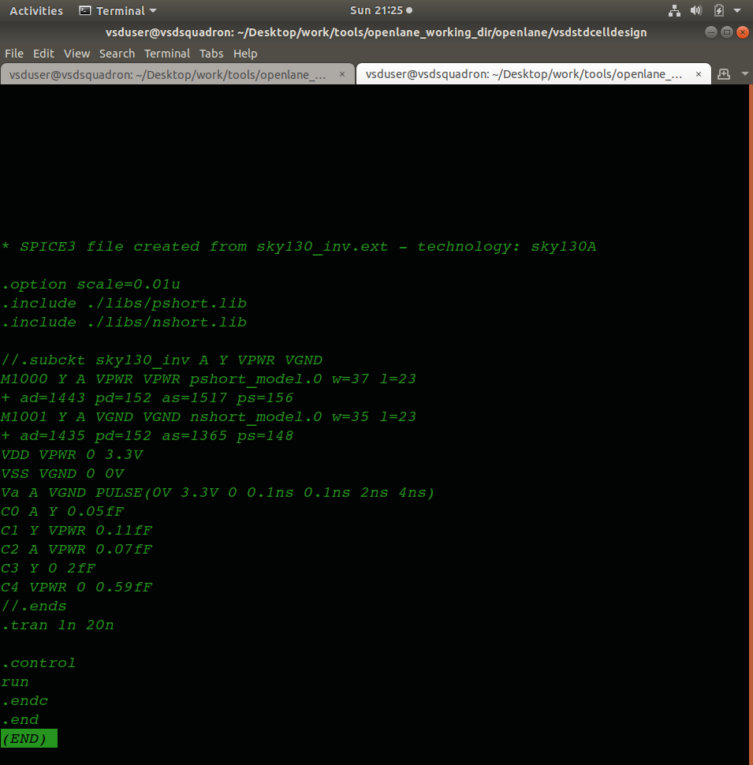
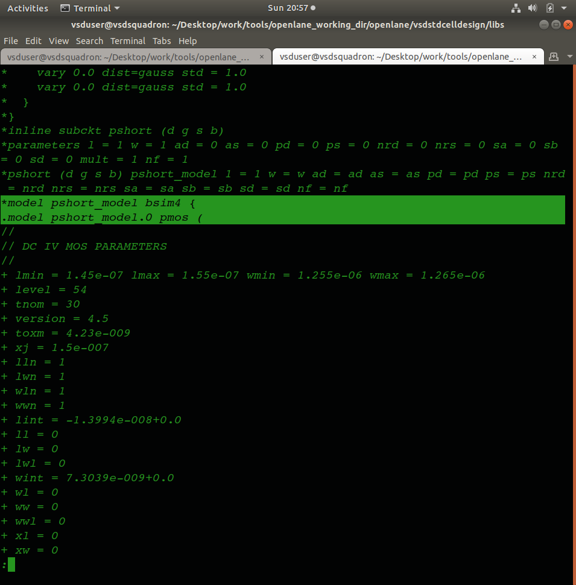

# Day 8 – Sky130 Standard Cell Design: SPICE Characterization, CMOS Layout & Tech-File DRC

## Objective

Day 8 shifts from digital RTL work into the analog/physical side of standard-cell design — building and simulating a CMOS inverter in ngspice, walking through the actual fabrication-style layout construction step by step in Magic, extracting a SPICE netlist straight from that layout, and finally working with the SKY130 technology file directly to understand and debug real DRC rules.

---

## Contents

1. [Part 1 — CMOS Inverter SPICE Characterization](#1-part-1--cmos-inverter-spice-characterization)
2. [Part 2 — How a CMOS Inverter Is Actually Fabricated](#2-part-2--how-a-cmos-inverter-is-actually-fabricated)
3. [Part 3 — Building the Layout & Extracting SPICE in Magic](#3-part-3--building-the-layout--extracting-spice-in-magic)
4. [Part 4 — Sky130 Tech File & DRC Debugging](#4-part-4--sky130-tech-file--drc-debugging)
5. [Conclusion](#5-conclusion)

---

## 1. Part 1 — CMOS Inverter SPICE Characterization

Before touching any layout tool, the inverter is built and studied purely at the SPICE level — transistor models, sizing, and connectivity only, no geometry involved yet.

### SPICE Deck Creation

```spice
* CMOS Inverter
.include ./sky130_model.lib
XM1 out in vdd vdd pshort_model w=1 l=0.15
XM2 out in 0 0 nshort_model w=0.36 l=0.15
Vdd vdd 0 1.8
Vin in 0 pulse(0 1.8 0 0.1n 0.1n 2n 4n)
.tran 0.01n 10n
.control
run
.endc
.end
```



### Running the Simulation

```bash
ngspice sky130_inv.spice
```

Once inside the ngspice control prompt, the output waveform is plotted directly:

```
plot y vs time a
```



### Switching Threshold (V_M) and the VTC

The Voltage Transfer Characteristic (VTC) plots output voltage against input voltage as the input sweeps from 0 to VDD. The **switching threshold, V_M**, is the point on this curve where `V_in = V_out` — the exact balance point between the inverter pulling its output high versus low.



`V_M` isn't determined by supply voltage alone — it depends heavily on the **PMOS-to-NMOS width ratio**. Since electron mobility is higher than hole mobility, the PMOS is normally drawn wider than the NMOS to balance pull-up and pull-down drive strength; shifting that ratio moves `V_M` left or right along the VTC curve.

### Static vs. Dynamic Simulation

- **Static (DC) simulation** sweeps the input slowly and traces out the VTC curve — this is what `V_M`, noise margins, and gain get extracted from.
- **Dynamic (transient) simulation** drives the gate with a real clocked/pulsed input and observes propagation delay, rise/fall time, and actual switching speed over time.

---

## 2. Part 2 — How a CMOS Inverter Is Actually Fabricated

Rather than treating the inverter layout as something just "drawn," this section walks through the real fabrication sequence a foundry follows to physically build it — layer by layer, mask by mask.

1. **Substrate selection** — the process starts with a lightly doped p-type silicon substrate, the base material every other layer gets built on top of.
2. **Isolation (SiO₂ formation)** — a thin silicon dioxide layer is grown thermally across the wafer, which will later be selectively etched to define where active device regions sit versus where isolation is needed.
3. **Photoresist patterning** — a photoresist layer is applied and exposed through a mask, defining exactly which regions get etched or doped in the following steps. This same photolithography step repeats before nearly every subsequent layer.
4. **N-well and P-well formation** — dopants are implanted to create the n-well (which will host the PMOS device) and p-well (which will host the NMOS device) — this is what lets both transistor types coexist on the same substrate.
5. **Gate formation** — a thin gate-oxide layer is grown, polysilicon is deposited on top, and it's patterned into the actual gate terminals for both transistors. Gate length here directly determines the channel length of each device.
6. **Source/drain formation** — dopant implantation forms the source and drain regions on either side of each gate (n+ for NMOS, p+ for PMOS), completing the actual active transistor structure. A lightly-doped drain (LDD) implant is typically done first near the gate edge to reduce hot-carrier degradation, followed by the heavier source/drain implant.
7. **Contact formation** — an etch step opens contact holes down to the source, drain, and gate terminals, which then get filled with a conductive material to bring those terminals up out of the silicon.
8. **Local interconnect / etch step** — excess material from the contact fill is etched back, leaving clean, isolated contact plugs rather than a continuous conductive sheet.
9. **Metal formation** — metal1 (and higher layers as needed) is deposited and patterned to actually wire the transistors together into the inverter's input/output/power connections.
10. **Final structure** — after all layers are stacked and connected, the result is a complete, fabricated CMOS inverter — the same structure the layout in Magic (Part 3) is a geometric abstraction of.

This sequence is exactly why a "layout" isn't just artwork — every shape drawn in Magic corresponds to a real mask used in one of these actual fabrication steps.

---

## 3. Part 3 — Building the Layout & Extracting SPICE in Magic

With the fabrication sequence understood conceptually, the actual inverter cell is built in Magic using SKY130's real layer set, then a SPICE netlist is extracted directly from that geometry to close the loop with Part 1.

### Cloning the Standard Cell Design Repository

```bash
git clone https://github.com/nickson-jose/vsdstdcelldesign
cd vsdstdcelldesign
```

### Opening the Layout in Magic

```bash
magic -T sky130A.tech sky130_inv.mag &
```



### Extracting SPICE from the Layout (TKCon commands)

Inside Magic's TKCon window, the drawn layout is extracted straight into a SPICE deck:

```
what
extract all
ext2spice cthresh 0 rthresh 0
ext2spice
box
```

- `what` — reports what's currently selected in the layout
- `extract all` — extracts the full circuit (devices + connectivity) from the drawn geometry
- `ext2spice cthresh 0 rthresh 0` — configures the extraction to include all parasitic capacitance/resistance, however small, rather than thresholding small values away
- `ext2spice` — writes out the actual `.spice` netlist
- `box` — reports the coordinates of the current selection box, useful while checking geometry

### Inspecting and Re-simulating the Extracted Netlist

```bash
less sky130_inv.spice
```

Then, back in ngspice:

```
i
wq
ngspice sky130_inv.spice
plot y vs time a
```



Since this netlist was extracted directly from the physical layout (not hand-written), getting a matching VTC/switching behavior here is direct proof that the drawn geometry actually implements the intended inverter — this is conceptually the same check LVS performs formally.

---

## 4. Part 4 — Sky130 Tech File & DRC Debugging

The final part works directly with Magic's DRC engine against the SKY130 rule set — treating the `.tech` file not as a black box, but as a real, debuggable set of geometric rules.

### Checking Design Rules Interactively

```
box
what
drc check
drc why
drc find
```

- `box` / `what` — confirm exactly what region/object is currently selected before running a check
- `drc check` — runs the DRC engine against the current layout
- `drc why` — explains *which* specific rule a flagged violation is failing, rather than just flagging that something is wrong
- `drc find` — jumps to the next DRC violation in the layout, useful for working through a list of errors one at a time

### Debugging Exercises Performed

- **`poly.9` rule violation** — traced the specific spacing/width condition this rule enforces in the Sky130 tech file, and corrected the layout to satisfy it.
- **Poly resistor spacing to diffusion/tap** — implemented the correct minimum spacing between a poly resistor structure and nearby diffusion/tap regions, which exists to prevent unwanted parasitic coupling into the substrate contacts.
- **Reading a DRC rule as a geometric construct** — worked backward from the rule's text definition to the actual 2D shapes and spacing it describes, since tech-file rule syntax is often fairly terse for what can be a fairly involved geometric relationship.
- **Finding and fixing missing/incorrect rules** — audited a section of the tech file for rules that were absent or defined incorrectly, and corrected them — a good test of actually understanding what each rule is meant to enforce, rather than just trusting the file as-is.

Standard-cell library characterization data (referencing the actual Sky130 device models used above, e.g. `pshort_model`):



---

## 5. Conclusion

Day 8 connected the same physical object from three different angles: **SPICE-level** behavior (why the inverter switches where it does, and why sizing ratio matters), **fabrication-level** reality (the actual sequence of substrate, wells, gate, source/drain, contacts, and metal that builds a real transistor), and **layout/DRC-level** constraints (what a legal drawn geometry actually has to satisfy). Extracting a SPICE netlist directly from a hand-drawn Magic layout — and having it simulate correctly — was the clearest proof that all three views describe the same underlying device. The DRC debugging work, especially tracing `poly.9` and auditing rules for correctness, was a good reminder that a `.tech` file is a real, human-authored (and occasionally imperfect) geometric rulebook, not just something to trust blindly.
