# Day 9 – Custom Cell Integration, Timing Optimization & Multi-Corner STA

## Objective

Day 9 covers two connected threads in getting PicoRV32 closer to a timing-clean implementation: **integrating a custom standard cell** (the hand-built inverter from Day 8) into the OpenLane synthesis flow, and **exploring synthesis strategy knobs** aimed specifically at improving delay. On top of that, OpenSTA is used to run genuine multi-corner (typical/fast/slow) setup and hold analysis on the synthesized netlist — going beyond the single-corner checks from earlier sessions.

---

## Contents

1. [Integrating a Custom Standard Cell into OpenLane](#1-integrating-a-custom-standard-cell-into-openlane)
2. [Synthesis Strategy & Delay Optimization](#2-synthesis-strategy--delay-optimization)
3. [Viewing the Updated Placement in Magic](#3-viewing-the-updated-placement-in-magic)
4. [Multi-Corner Static Timing Analysis with OpenSTA](#4-multi-corner-static-timing-analysis-with-opensta)
5. [Setup and Hold Timing](#5-setup-and-hold-timing)
6. [Conclusion](#6-conclusion)

---

## 1. Integrating a Custom Standard Cell into OpenLane

Rather than relying only on the stock SKY130 cell library, this step brings the custom inverter cell built in Day 8 (`vsdinv`) directly into the OpenLane flow as an additional standard cell.

**LEF abstract for the custom cell** — this is what OpenLane actually reads to understand the cell's pin locations and boundary, without needing its internal layout:

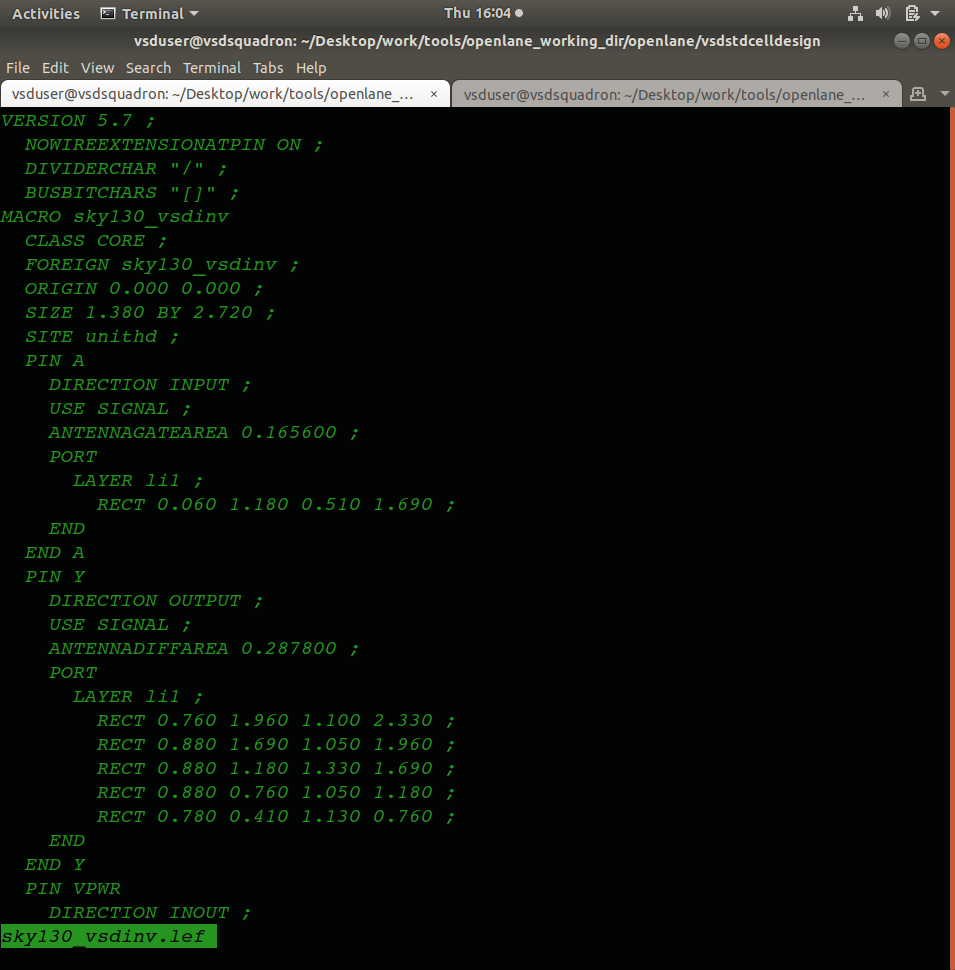

**Track information file** — defines the routing track grid (pitch and offset per metal layer) the custom cell's pins need to align to, so the placer and router treat it exactly like any other standard cell:

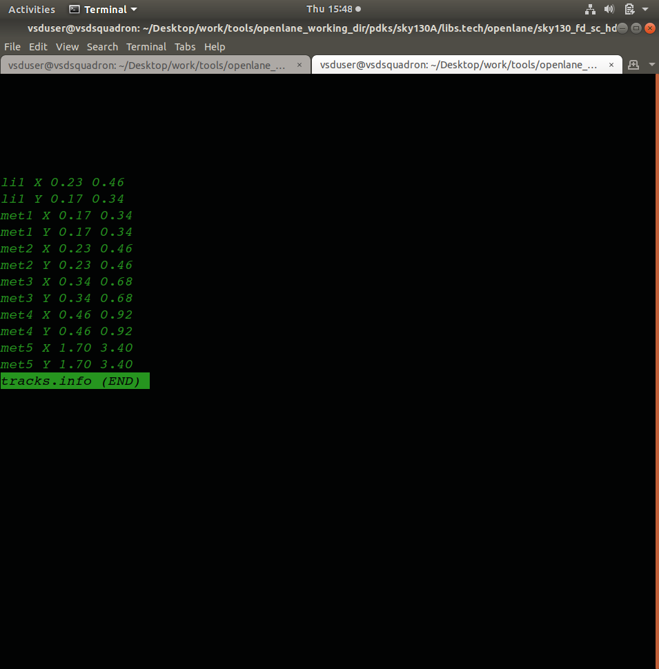

**Updating `config.tcl`** to point OpenLane at the extra LEF file for the custom cell:


**Pre-synthesis configuration check** — confirming the flow config picks up the custom cell correctly before re-running synthesis:


**Resulting placement with the custom cell included:**

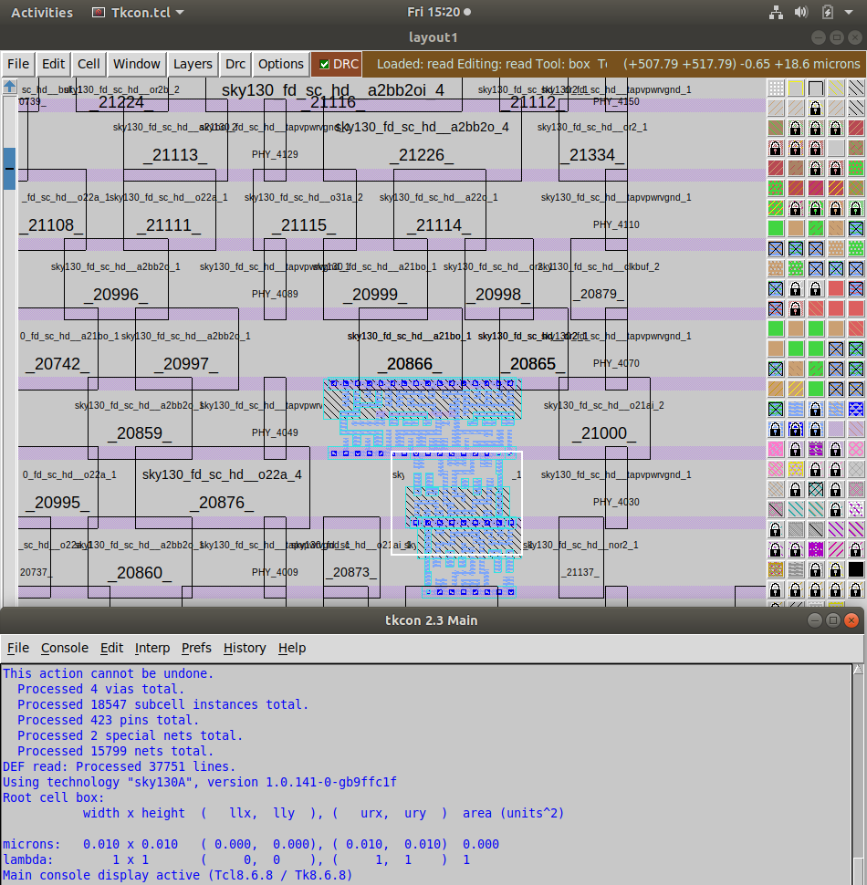

Once these pieces are in place, OpenLane treats `vsdinv` as a first-class citizen of the SKY130 library for this design — it can be selected during synthesis and technology mapping exactly like any stock cell.

---

## 2. Synthesis Strategy & Delay Optimization

With the flow already running, a second synthesis run was configured specifically to push for lower delay, using a separate run tag so it doesn't overwrite the original results:

```tcl
prep -design picorv32a -tag timing_opt_1 -overwrite

set ::env(SYNTH_STRATEGY) "DELAY 3"
set ::env(SYNTH_BUFFERING) 1
set ::env(SYNTH_SIZING) 1

echo $::env(SYNTH_STRATEGY)
echo $::env(SYNTH_BUFFERING)
echo $::env(SYNTH_SIZING)

run_synthesis
run_floorplan
run_placement
```

**What each of these knobs actually does:**

| Setting | Effect |
|---|---|
| `SYNTH_STRATEGY "DELAY 3"` | Biases Yosys/ABC's synthesis effort toward minimizing delay rather than area — "3" selects a specific aggressiveness level for this strategy |
| `SYNTH_BUFFERING = 1` | Enables automatic buffer insertion during synthesis, helping drive high-fanout or long nets that would otherwise slow down |
| `SYNTH_SIZING = 1` | Allows the synthesis tool to upsize/downsize gates as needed to help meet timing, instead of using a single fixed drive strength throughout |

Running synthesis, floorplan, and placement again under a new tag (`timing_opt_1`) means the original run's results stay untouched — a clean way to compare "before" and "after" without losing either result set.

---

## 3. Viewing the Updated Placement in Magic

```bash
magic -T /home/vsduser/Desktop/work/tools/openlane_working_dir/pdks/sky130A/libs.tech/magic/sky130A.tech \
  lef read ../../tmp/merged_unpadded.lef \
  def read picorv32a.placement.def
```

This loads the placement DEF from the new `timing_opt_1` run so the effect of the strategy/buffering/sizing changes can actually be inspected visually against the earlier placement, rather than just trusting the reported numbers.

---

## 4. Multi-Corner Static Timing Analysis with OpenSTA

Rather than checking timing against a single library, this stage runs OpenSTA against **typical, fast, and slow** SKY130 corners together — since a real design has to meet timing across all of them, not just the nominal case.

```bash
cd /home/vsduser/Desktop/work/tools/openlane_working_dir/OpenSTA
unalias docker
docker run -i -v $HOME:/data opensta
```

Inside the OpenSTA session:

```tcl
read_liberty -min /data/.../src/sky130_fd_sc_hd__typical.lib
read_liberty -max /data/.../src/sky130_fd_sc_hd__typical.lib

read_liberty -min /data/.../src/sky130_fd_sc_hd__fast.lib
read_liberty -max /data/.../src/sky130_fd_sc_hd__slow.lib

read_liberty -max /data/.../src/sky130_fd_sc_hd__fast.lib
read_liberty -min /data/.../src/sky130_fd_sc_hd__slow.lib

read_verilog /data/.../results/synthesis/picorv32a.synthesis.v
link_design picorv32a
read_sdc /data/.../src/my_base.sdc

report_checks -path_delay max
report_checks -path_delay min_max -fields {nets cap slew input_pins fanout}
```

**Why load `typical`, `fast`, *and* `slow` together:** pairing `-min`/`-max` across different corners (fast for min, slow for max, and so on) is exactly how real sign-off timing works — the worst-case **setup** check needs the slowest realistic corner, while the worst-case **hold** check needs the fastest realistic corner. Checking only the typical corner would miss both of these real failure modes.

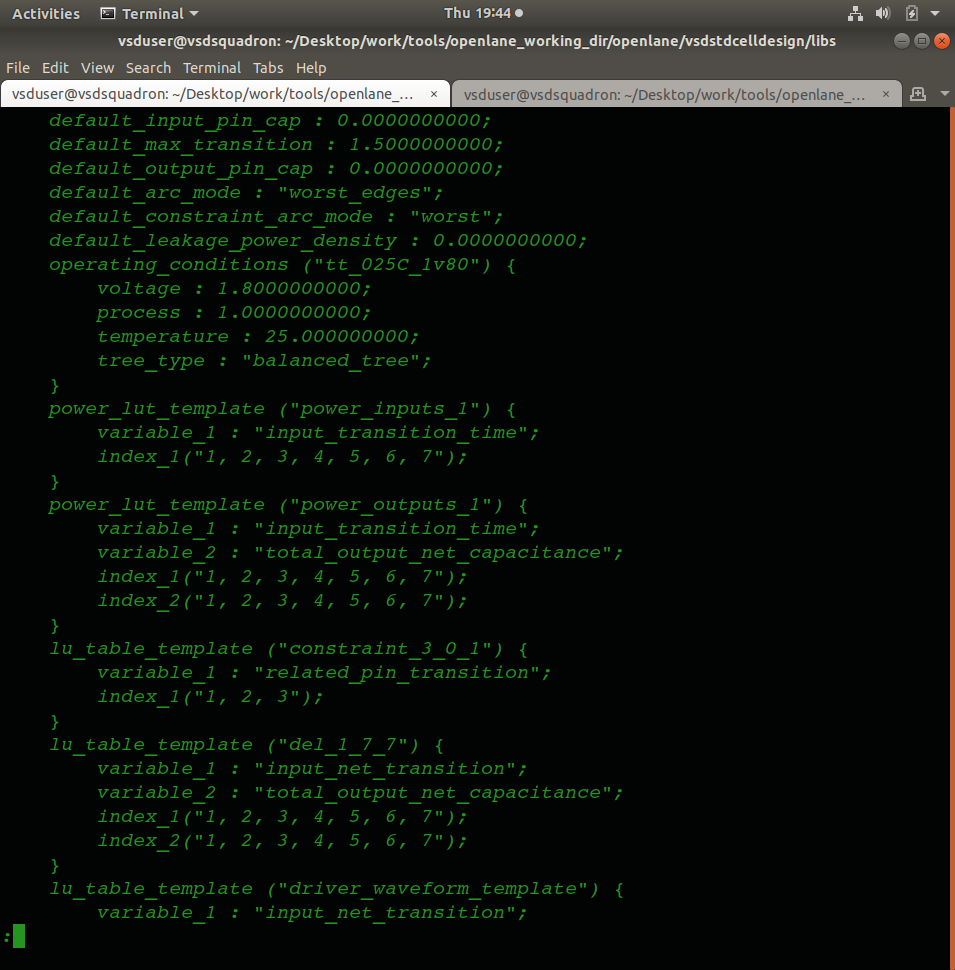
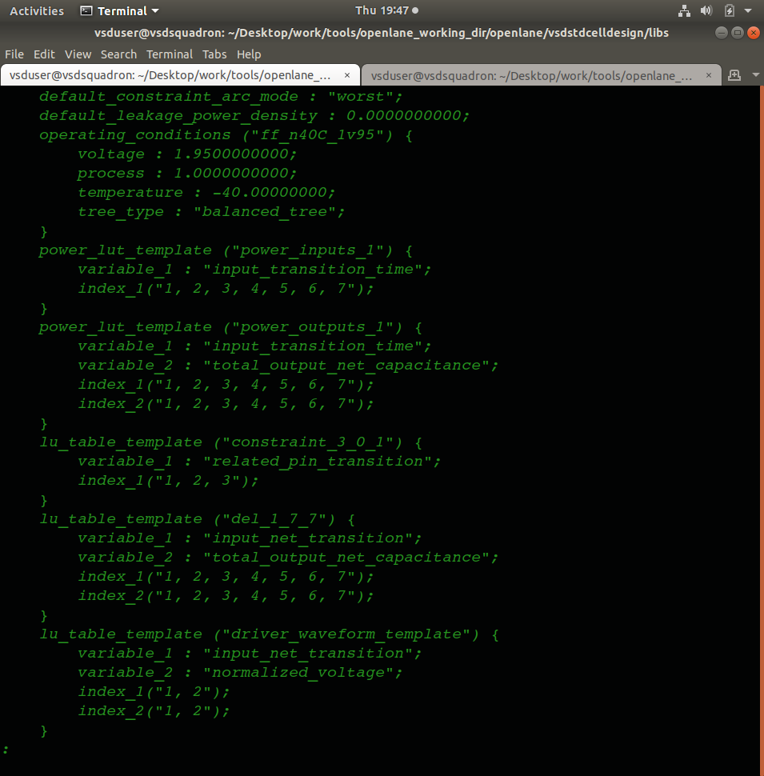
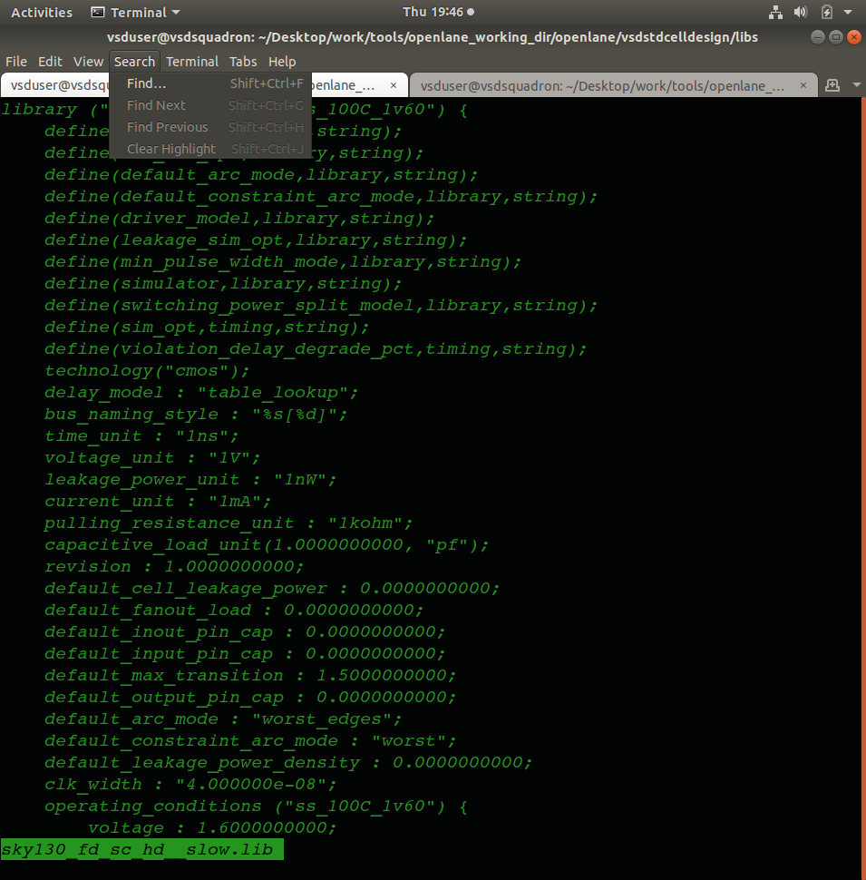

**The SDC constraints file** used to define clock and timing intent for this analysis:

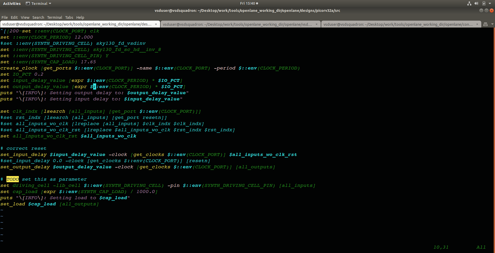

**`report_checks -path_delay max`** — reports the worst-case setup-side timing path:

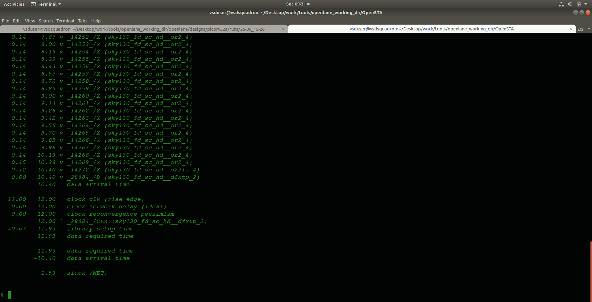

**`report_checks -path_delay min_max`** with extra fields (`nets`, `cap`, `slew`, `input_pins`, `fanout`) — gives both the setup (max) and hold (min) picture together, along with the physical parasitics contributing to each path's delay:

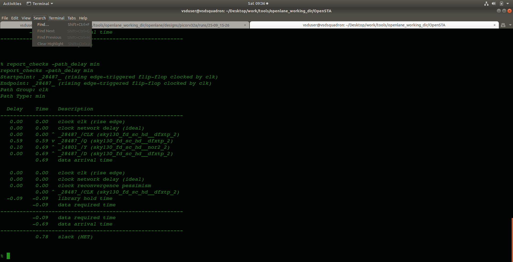
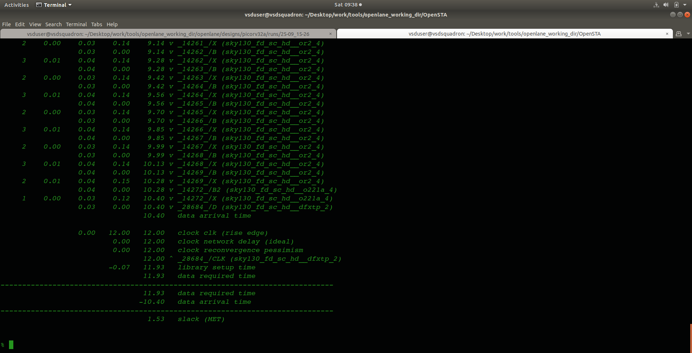

---

## 5. Setup and Hold Timing

Every flip-flop-to-flip-flop path in the design has to satisfy two separate timing constraints:

- **Setup check** — the data must arrive at the destination flip-flop *early enough* before the next clock edge. This is checked against the **slowest** realistic corner, since that's when data takes longest to arrive.
- **Hold check** — the data must *not* arrive too early relative to the current clock edge (which would corrupt the value being captured). This is checked against the **fastest** realistic corner, since that's when data arrives soonest.

```
Slack (setup) = Required Time (max) − Arrival Time
Slack (hold)  = Arrival Time − Required Time (min)
```

Positive slack on both checks means the path is timing-clean; negative slack on either one is a real violation that needs to be fixed — whether through resizing, buffering, or restructuring logic on that path.

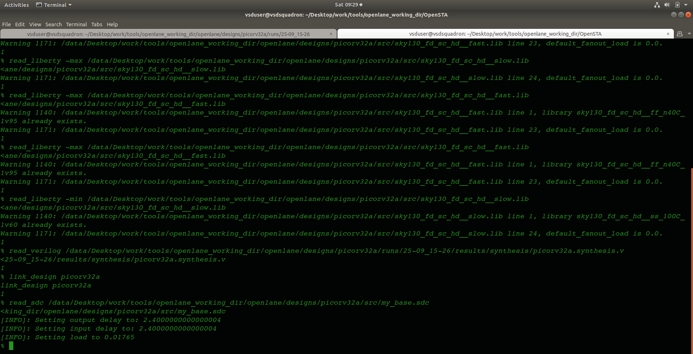

This is exactly why the custom-cell integration and synthesis-strategy work earlier in this session matter in practice — every knob turned (buffering, sizing, cell choice) shows up directly in these setup/hold numbers.

---

## 6. Conclusion

Day 9 tied the standard-cell work from Day 8 back into the physical-design flow — integrating a custom cell isn't just a Magic/LEF exercise, it's something that has to actually plug into OpenLane's synthesis and placement stages cleanly. The synthesis-strategy exploration (`DELAY 3`, buffering, sizing) showed that timing isn't purely a placement/routing problem — decisions made all the way back at synthesis directly shape what's achievable later. And running true multi-corner STA (typical/fast/slow) in OpenSTA — rather than a single nominal check — is what actually reflects how real sign-off timing works: setup checked against the worst (slow) corner, hold checked against the best (fast) corner, both needing to pass before a design is genuinely timing-clean.
